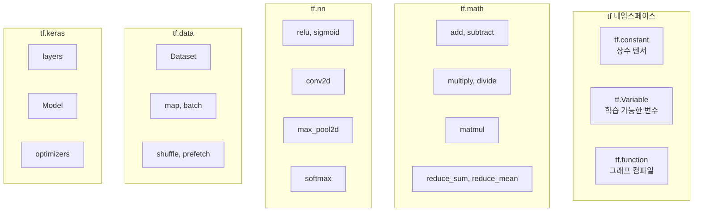

# Python API 레퍼런스

TensorFlow의 주요 Python API를 카테고리별로 정리했습니다.

## API 카테고리 개요



---

## 핵심 텐서 API

### tf.constant

상수 텐서를 생성합니다. 값이 변경되지 않습니다.

```python
# 시그니처
tf.constant(
    value,                # 텐서 값
    dtype=None,           # 데이터 타입 (tf.float32, tf.int32 등)
    shape=None,           # 출력 shape
    name='Const'          # 연산 이름
)
```

**예시**:
```python
import tensorflow as tf

# 스칼라
scalar = tf.constant(5)
print(scalar)  # tf.Tensor(5, shape=(), dtype=int32)

# 벡터
vector = tf.constant([1, 2, 3])
print(vector)  # tf.Tensor([1 2 3], shape=(3,), dtype=int32)

# 행렬 (dtype 지정)
matrix = tf.constant([[1, 2], [3, 4]], dtype=tf.float32)
print(matrix.dtype)  # <dtype: 'float32'>

# 문자열
text = tf.constant("Hello, TensorFlow!")
print(text.numpy())  # b'Hello, TensorFlow!'
```

---

### tf.Variable

학습 가능한 변수를 생성합니다. 값이 변경될 수 있습니다.

```python
# 시그니처
tf.Variable(
    initial_value,        # 초기값
    trainable=True,       # 학습 가능 여부
    validate_shape=True,  # shape 검증
    name=None,            # 변수 이름
    dtype=None            # 데이터 타입
)
```

**예시**:
```python
import tensorflow as tf

# 기본 변수 생성
weight = tf.Variable([1.0, 2.0, 3.0])
print(weight.numpy())  # [1. 2. 3.]

# 값 할당
weight.assign([4.0, 5.0, 6.0])
print(weight.numpy())  # [4. 5. 6.]

# 덧셈으로 업데이트
weight.assign_add([1.0, 1.0, 1.0])
print(weight.numpy())  # [5. 6. 7.]

# 곱셈으로 업데이트
weight.assign_sub([0.5, 0.5, 0.5])
print(weight.numpy())  # [4.5 5.5 6.5]

# 학습 불가능한 변수
counter = tf.Variable(0, trainable=False)
```

---

### tf.function

Python 함수를 TensorFlow 그래프로 컴파일합니다.

```python
# 시그니처
@tf.function(
    input_signature=None,  # 입력 텐서 사양
    autograph=True,        # AutoGraph 사용
    jit_compile=False,     # XLA JIT 컴파일
    reduce_retracing=False # 재트레이싱 감소
)
def my_function(...):
    ...
```

**예시**:
```python
import tensorflow as tf

# 기본 사용
@tf.function
def compute(x, y):
    return x * y + x

result = compute(tf.constant(3.0), tf.constant(2.0))
print(result.numpy())  # 9.0

# 입력 시그니처 지정
@tf.function(input_signature=[
    tf.TensorSpec(shape=[None, 10], dtype=tf.float32),
    tf.TensorSpec(shape=[10, 5], dtype=tf.float32)
])
def matmul_func(a, b):
    return tf.matmul(a, b)

# XLA 컴파일 활성화
@tf.function(jit_compile=True)
def xla_compute(x):
    return tf.reduce_sum(x * x)
```

:::caution 트레이싱 주의사항
Python 코드는 트레이싱 시에만 실행됩니다:
```python
@tf.function
def traced_func():
    print("트레이싱 시에만 실행")  # 첫 호출에만
    tf.print("매번 실행")          # 모든 호출에서
```
:::

---

## 수학 연산 API

### 기본 산술 연산

```python
import tensorflow as tf

a = tf.constant([1, 2, 3])
b = tf.constant([4, 5, 6])

# 덧셈
tf.add(a, b)        # [5, 7, 9]
a + b               # 같은 결과

# 뺄셈
tf.subtract(a, b)   # [-3, -3, -3]
a - b               # 같은 결과

# 곱셈 (요소별)
tf.multiply(a, b)   # [4, 10, 18]
a * b               # 같은 결과

# 나눗셈
tf.divide(a, b)     # [0.25, 0.4, 0.5]
a / b               # 같은 결과

# 거듭제곱
tf.pow(a, 2)        # [1, 4, 9]
a ** 2              # 같은 결과
```

---

### 행렬 연산

```python
import tensorflow as tf

# 행렬 곱셈
a = tf.constant([[1, 2], [3, 4]], dtype=tf.float32)
b = tf.constant([[5, 6], [7, 8]], dtype=tf.float32)

result = tf.matmul(a, b)  # [[19, 22], [43, 50]]

# 전치
tf.transpose(a)  # [[1, 3], [2, 4]]

# 역행렬
tf.linalg.inv(a)

# 행렬식
tf.linalg.det(a)  # -2.0

# 고유값/고유벡터
eigenvalues, eigenvectors = tf.linalg.eig(a)
```

---

### 축소 연산

```python
import tensorflow as tf

x = tf.constant([[1, 2, 3], [4, 5, 6]], dtype=tf.float32)

# 전체 합계
tf.reduce_sum(x)           # 21.0

# 축별 합계
tf.reduce_sum(x, axis=0)   # [5, 7, 9] (열 합계)
tf.reduce_sum(x, axis=1)   # [6, 15] (행 합계)

# 평균
tf.reduce_mean(x)          # 3.5

# 최대/최소
tf.reduce_max(x)           # 6.0
tf.reduce_min(x)           # 1.0

# 곱
tf.reduce_prod(x)          # 720.0

# argmax/argmin
tf.argmax(x, axis=1)       # [2, 2] (각 행에서 최대값 인덱스)
```

---

## 신경망 API (tf.nn)

### 활성화 함수

```python
import tensorflow as tf

x = tf.constant([-2.0, -1.0, 0.0, 1.0, 2.0])

# ReLU
tf.nn.relu(x)         # [0, 0, 0, 1, 2]

# Sigmoid
tf.nn.sigmoid(x)      # [0.12, 0.27, 0.5, 0.73, 0.88]

# Tanh
tf.nn.tanh(x)         # [-0.96, -0.76, 0, 0.76, 0.96]

# Softmax
logits = tf.constant([1.0, 2.0, 3.0])
tf.nn.softmax(logits) # [0.09, 0.24, 0.67]

# Leaky ReLU
tf.nn.leaky_relu(x, alpha=0.2)

# GELU (Gaussian Error Linear Unit)
tf.nn.gelu(x)
```

---

### 컨볼루션

```python
import tensorflow as tf

# 2D 컨볼루션
# input shape: [batch, height, width, channels]
# filter shape: [filter_height, filter_width, in_channels, out_channels]

input_tensor = tf.random.normal([1, 28, 28, 1])
filters = tf.random.normal([3, 3, 1, 32])

output = tf.nn.conv2d(
    input=input_tensor,
    filters=filters,
    strides=[1, 1, 1, 1],  # [batch, height, width, channel]
    padding='SAME'          # 'SAME' or 'VALID'
)
print(output.shape)  # (1, 28, 28, 32)
```

---

### 풀링

```python
import tensorflow as tf

input_tensor = tf.random.normal([1, 28, 28, 32])

# 최대 풀링
max_pool = tf.nn.max_pool2d(
    input=input_tensor,
    ksize=[1, 2, 2, 1],     # 풀링 윈도우 크기
    strides=[1, 2, 2, 1],   # 스트라이드
    padding='SAME'
)
print(max_pool.shape)  # (1, 14, 14, 32)

# 평균 풀링
avg_pool = tf.nn.avg_pool2d(
    input=input_tensor,
    ksize=[1, 2, 2, 1],
    strides=[1, 2, 2, 1],
    padding='SAME'
)
```

---

## 데이터 파이프라인 API (tf.data)

### Dataset 생성

```python
import tensorflow as tf

# 텐서에서 생성
dataset = tf.data.Dataset.from_tensor_slices([1, 2, 3, 4, 5])

# 튜플에서 생성
features = tf.constant([[1, 2], [3, 4], [5, 6]])
labels = tf.constant([0, 1, 0])
dataset = tf.data.Dataset.from_tensor_slices((features, labels))

# 제너레이터에서 생성
def gen():
    for i in range(10):
        yield i

dataset = tf.data.Dataset.from_generator(
    gen,
    output_signature=tf.TensorSpec(shape=(), dtype=tf.int32)
)
```

---

### Dataset 변환

```python
import tensorflow as tf

dataset = tf.data.Dataset.range(100)

# Map: 각 요소에 함수 적용
dataset = dataset.map(lambda x: x * 2)

# Filter: 조건에 맞는 요소만 유지
dataset = dataset.filter(lambda x: x > 50)

# Batch: 배치로 그룹화
dataset = dataset.batch(32)

# Shuffle: 셔플
dataset = dataset.shuffle(buffer_size=1000)

# Prefetch: 백그라운드에서 미리 로드
dataset = dataset.prefetch(tf.data.AUTOTUNE)

# Repeat: 데이터셋 반복
dataset = dataset.repeat(3)  # 3번 반복

# Take: 처음 N개만 가져오기
dataset = dataset.take(10)
```

---

### 완전한 파이프라인 예시

```python
import tensorflow as tf

def preprocess(image, label):
    image = tf.cast(image, tf.float32) / 255.0
    return image, label

(x_train, y_train), (x_test, y_test) = tf.keras.datasets.mnist.load_data()

train_ds = tf.data.Dataset.from_tensor_slices((x_train, y_train))
train_ds = (train_ds
    .shuffle(10000)
    .map(preprocess, num_parallel_calls=tf.data.AUTOTUNE)
    .batch(32)
    .prefetch(tf.data.AUTOTUNE))

# 데이터셋 반복
for images, labels in train_ds:
    print(images.shape, labels.shape)
    break  # (32, 28, 28), (32,)
```

---

## 자동 미분 API

### GradientTape

```python
import tensorflow as tf

# 기본 사용
x = tf.Variable(3.0)

with tf.GradientTape() as tape:
    y = x ** 2

dy_dx = tape.gradient(y, x)
print(dy_dx.numpy())  # 6.0

# 여러 변수
w = tf.Variable(2.0)
b = tf.Variable(1.0)

with tf.GradientTape() as tape:
    y = w * x + b

gradients = tape.gradient(y, [w, b])
print([g.numpy() for g in gradients])  # [3.0, 1.0]
```

---

### 지속 테이프 (Persistent Tape)

```python
import tensorflow as tf

x = tf.Variable(3.0)

# persistent=True로 여러 번 gradient 호출 가능
with tf.GradientTape(persistent=True) as tape:
    y = x ** 2
    z = y ** 2

dy_dx = tape.gradient(y, x)  # 6.0
dz_dx = tape.gradient(z, x)  # 108.0

del tape  # 메모리 해제
```

---

### 고차 미분

```python
import tensorflow as tf

x = tf.Variable(3.0)

# 2차 미분
with tf.GradientTape() as tape2:
    with tf.GradientTape() as tape1:
        y = x ** 3  # y = x³

    dy_dx = tape1.gradient(y, x)  # 3x² = 27

d2y_dx2 = tape2.gradient(dy_dx, x)  # 6x = 18
print(d2y_dx2.numpy())  # 18.0
```

---

## 저장 및 로드 API

### SavedModel

```python
import tensorflow as tf

# 모델 정의
class MyModel(tf.Module):
    def __init__(self):
        self.v = tf.Variable(5.0)

    @tf.function(input_signature=[tf.TensorSpec(shape=[], dtype=tf.float32)])
    def multiply(self, x):
        return self.v * x

model = MyModel()

# 저장
tf.saved_model.save(model, 'my_model')

# 로드
loaded = tf.saved_model.load('my_model')
result = loaded.multiply(tf.constant(3.0))
print(result.numpy())  # 15.0
```

---

### 체크포인트

```python
import tensorflow as tf

# 체크포인트 생성
model = tf.keras.Sequential([
    tf.keras.layers.Dense(10, input_shape=(5,))
])
optimizer = tf.keras.optimizers.Adam()

checkpoint = tf.train.Checkpoint(model=model, optimizer=optimizer)

# 저장
checkpoint.save('ckpt/model')

# 복원
checkpoint.restore(tf.train.latest_checkpoint('ckpt'))
```

---

## 데이터 타입 (tf.dtypes)

| 타입 | 설명 | Python 동등 |
|------|------|-------------|
| `tf.float16` | 16비트 부동소수점 | - |
| `tf.float32` | 32비트 부동소수점 | `float` |
| `tf.float64` | 64비트 부동소수점 | - |
| `tf.int8` | 8비트 정수 | - |
| `tf.int16` | 16비트 정수 | - |
| `tf.int32` | 32비트 정수 | `int` |
| `tf.int64` | 64비트 정수 | - |
| `tf.bool` | 불리언 | `bool` |
| `tf.string` | 바이트 문자열 | `bytes` |
| `tf.complex64` | 복소수 (float32 + float32) | - |
| `tf.complex128` | 복소수 (float64 + float64) | `complex` |

```python
import tensorflow as tf

# 타입 변환
x = tf.constant([1, 2, 3])
x_float = tf.cast(x, tf.float32)

# 타입 확인
print(x.dtype)        # <dtype: 'int32'>
print(x_float.dtype)  # <dtype: 'float32'>
```
