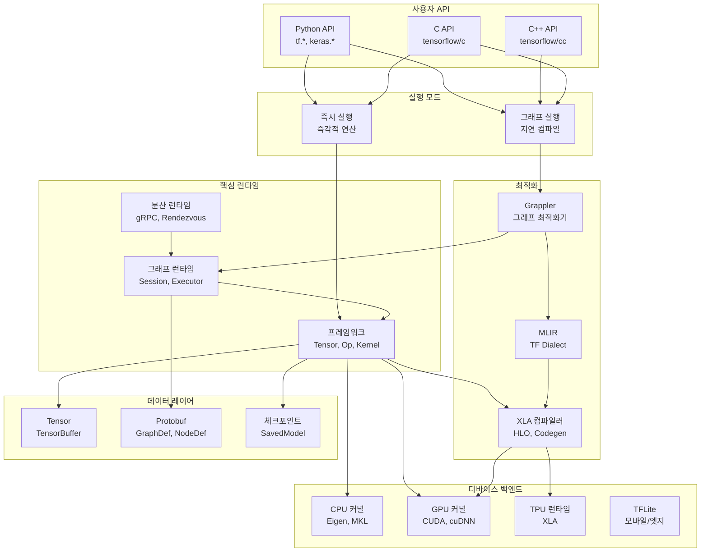
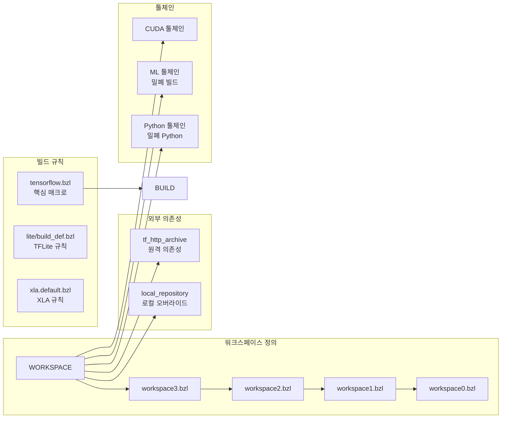
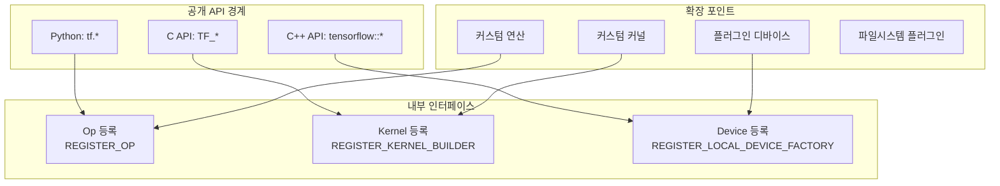

# 아키텍처 개요

TensorFlow의 내부 구조와 설계 원리를 설명합니다. 이 문서를 통해 TensorFlow가 **왜** 이렇게 설계되었는지 이해할 수 있습니다.

## 프로젝트 유형

TensorFlow는 **엔드투엔드 오픈소스 머신러닝 플랫폼**입니다:

- 모델 구축, 학습, 배포를 위한 대규모 계산 프레임워크
- 핵심 런타임, 컴파일러(XLA), 모바일 런타임(TFLite), Python API를 포함하는 모노레포

## 고수준 아키텍처



## 디렉토리 구조

```
/tensorflow (루트)
├── BUILD                     # 루트 Bazel 빌드 파일
├── WORKSPACE                 # 외부 의존성이 포함된 Bazel 워크스페이스
├── configure.py              # 빌드 구성 스크립트
├── requirements_lock_*.txt   # Python 의존성 잠금 (3.9-3.13)
│
├── tensorflow/               # 메인 TensorFlow 소스
│   ├── c/                   # C API - 안정적인 외부 인터페이스
│   ├── cc/                  # C++ API - 고수준 클라이언트 인터페이스
│   ├── compiler/            # 컴파일러 인프라
│   │   ├── aot/            # Ahead-of-time 컴파일
│   │   ├── jit/            # Just-in-time 컴파일 (XLA)
│   │   ├── mlir/           # MLIR 기반 변환
│   │   ├── tf2xla/         # TensorFlow에서 XLA로의 브릿지
│   │   └── tf2tensorrt/    # TensorRT 통합
│   ├── core/               # 핵심 C++ 런타임
│   │   ├── common_runtime/ # 실행 인프라
│   │   ├── distributed_runtime/ # 분산 실행
│   │   ├── framework/      # Tensor, Op, Kernel 추상화
│   │   ├── graph/          # 계산 그래프 표현
│   │   ├── grappler/       # 그래프 최적화 프레임워크
│   │   ├── kernels/        # Op 커널 구현 (1170+ 파일)
│   │   ├── ops/            # Op 정의 및 등록
│   │   ├── platform/       # 플랫폼 추상화 레이어
│   │   ├── protobuf/       # 프로토콜 버퍼 정의
│   │   └── lib/            # 핵심 유틸리티
│   ├── dtensor/            # 분산 텐서 API
│   ├── lite/               # TensorFlow Lite (모바일/임베디드)
│   ├── python/             # Python API 레이어
│   │   ├── eager/          # 즉시 실행 모드
│   │   ├── framework/      # Python 프레임워크 바인딩
│   │   ├── ops/            # Python 연산 래퍼
│   │   ├── distribute/     # 분산 학습 전략
│   │   ├── keras/          # Keras 통합 (레거시)
│   │   └── saved_model/    # 모델 직렬화
│   └── tools/              # 개발 및 빌드 도구
│
├── third_party/            # 외부 의존성
│   ├── xla/               # XLA (Accelerated Linear Algebra) 컴파일러
│   ├── flatbuffers/       # 직렬화 라이브러리
│   └── [40개 이상 의존성]
│
└── ci/                     # 지속적 통합 구성
```

## 핵심 컴포넌트

| 컴포넌트 | 목적 | 위치 |
|----------|------|------|
| **Tensor** | N차원 타입 배열, 핵심 데이터 구조 | `/tensorflow/core/framework/tensor.h` |
| **TensorBuffer** | 텐서를 위한 참조 카운트 메모리 버퍼 | `/tensorflow/core/framework/tensor.h` |
| **OpKernel** | 연산 구현을 위한 베이스 클래스 | `/tensorflow/core/framework/op_kernel.h` |
| **Graph** | 연산과 텐서의 DAG | `/tensorflow/core/graph/graph.h` |
| **Session** | 그래프 실행 컨텍스트 (TF1) | `/tensorflow/core/common_runtime/session.h` |
| **Executor** | 디바이스에서 그래프 파티션 실행 | `/tensorflow/core/common_runtime/executor.cc` |
| **Device** | 계산 디바이스 추상화 | `/tensorflow/core/framework/device.h` |
| **Grappler** | 그래프 최적화 프레임워크 | `/tensorflow/core/grappler/` |
| **XLA** | Accelerated Linear Algebra 컴파일러 | `/third_party/xla/xla/` |
| **HLO** | XLA를 위한 High-Level Optimizer IR | `/third_party/xla/xla/hlo/` |
| **PJRT** | Portable JAX Runtime (디바이스 추상화) | `/third_party/xla/xla/pjrt/` |
| **TFLite Interpreter** | 모바일 추론 엔진 | `/tensorflow/lite/interpreter.h` |

---

## 설계 패턴

### 1. 데이터플로우 그래프 패턴

연산(노드)이 텐서(엣지)로 연결되어 방향성 비순환 그래프(DAG)를 형성하는 기본적인 계산 모델입니다.

```cpp
// tensorflow/core/graph/graph.h에서
// "Graph는 수행될 계산들과 그 계산들 간의 의존성을 설명합니다."
class Graph {
  // 노드는 연산을 표현
  // 엣지는 데이터 의존성을 표현
};
```

**왜 이 설계인가요?**
- 자동 미분, 최적화, 분산 실행이 가능
- 그래프 분석을 통해 병렬화 기회 식별
- 실행 전 그래프 변환으로 최적화

---

### 2. 레지스트리 패턴

연산 및 커널 등록에 광범위하게 사용됩니다:

- **OpRegistry**: 연산 정의 등록
- **KernelRegistry**: 디바이스별 커널 구현 등록
- **DeviceFactory**: 디바이스 타입 등록

```cpp
// 커널 등록 예시
REGISTER_KERNEL_BUILDER(Name("MatMul").Device(DEVICE_CPU), MatMulOp);
REGISTER_KERNEL_BUILDER(Name("MatMul").Device(DEVICE_GPU), MatMulOp);
```

**왜 이 설계인가요?**
- 프로그램 시작 시 자동으로 등록
- 명시적인 if/else 체인 없이 다형성 활성화
- 새로운 연산/커널 추가가 기존 코드 수정 없이 가능

---

### 3. 전략 패턴

`tf.distribute.Strategy`를 통한 분산 학습에 사용됩니다:

- `MirroredStrategy`
- `MultiWorkerMirroredStrategy`
- `TPUStrategy`
- `ParameterServerStrategy`

**왜 이 설계인가요?**
- 사용자 코드 변경 최소화로 분산 학습 전환
- 다양한 하드웨어 구성에 대한 통일된 인터페이스

---

### 4. 방문자 패턴

그래프 순회 및 최적화 패스(Grappler)에 사용됩니다:

```
tensorflow/core/grappler/optimizers/
├── arithmetic_optimizer.cc
├── constant_folding.cc
├── memory_optimizer.cc
└── [30개 이상의 최적화기]
```

---

### 5. 추상 팩토리 패턴

디바이스 생성이 팩토리 패턴을 따릅니다:

```cpp
class DeviceFactory {
  virtual Status CreateDevices(...) = 0;
};
```

---

### 6. 커맨드 패턴

연산이 계산 로직을 캡슐화합니다:

```cpp
class OpKernel {
  virtual void Compute(OpKernelContext* context) = 0;
};
```

---

### 7. 플러그인 아키텍처

다음을 통해 확장 가능:
- 커스텀 연산과 커널
- 플러그인 가능한 디바이스 (PluggableDevice API)
- 파일시스템 플러그인
- 프로파일러 플러그인

---

## 빌드 시스템 아키텍처 (Bazel)



### 빌드 매크로 (`/tensorflow/tensorflow.bzl`)

- `tf_cc_binary`: TensorFlow 인식 C++ 바이너리
- `tf_cc_test`: TF 의존성을 가진 테스트 타겟
- `pybind_extension`: Python 확장 모듈
- `cuda_library`: GPU 지원 라이브러리 타겟
- `if_cuda`, `if_rocm`, `if_mkl`: 조건부 컴파일

### 밀폐 빌드 시스템

TensorFlow는 재현성을 위해 밀폐 툴체인을 사용합니다:
- **rules_ml_toolchain**: C++ 툴체인 관리
- **밀폐 Python**: 격리된 Python 환경
- **밀폐 CUDA**: 버전 고정 CUDA/cuDNN

---

## 주요 의존성

### 핵심 런타임 의존성

| 의존성 | 목적 |
|--------|------|
| **Eigen3** | 선형대수를 위한 템플릿 라이브러리 (텐서, 행렬) |
| **Abseil (absl)** | Google의 C++ 유틸리티 라이브러리 |
| **Protobuf** | 직렬화를 위한 프로토콜 버퍼 |
| **gRPC** | 분산 실행을 위한 원격 프로시저 호출 |
| **FlatBuffers** | TFLite 모델을 위한 효율적인 직렬화 |
| **LLVM** | XLA/MLIR을 위한 컴파일러 인프라 |
| **oneDNN (MKL-DNN)** | Intel 최적화 딥러닝 프리미티브 |
| **XNNPACK** | 엣지 디바이스를 위한 신경망 추론 라이브러리 |

### GPU/가속기 의존성

| 의존성 | 목적 |
|--------|------|
| **CUDA** | NVIDIA GPU 지원 |
| **cuDNN** | NVIDIA 딥러닝 프리미티브 |
| **NCCL** | NVIDIA 집합 통신 라이브러리 |
| **TensorRT** | NVIDIA 추론 최적화기 |
| **ROCm** | AMD GPU 지원 |
| **SYCL** | Intel GPU 지원 |

---

## 모듈 경계와 인터페이스



---

## 외부 통합

| 통합 | 목적 |
|------|------|
| **TensorBoard** | 학습 시각화 및 디버깅 |
| **TensorFlow Hub** | 재사용 가능한 ML 모듈 저장소 |
| **TensorFlow Serving** | 프로덕션 모델 서빙 |
| **TensorFlow.js** | 브라우저 기반 ML |
| **TensorFlow Federated** | 연합 학습 |
| **ONNX** | 모델 교환 형식 |
| **SavedModel** | 이식 가능한 모델 형식 |

---

## 주요 아키텍처 결정과 그 이유

### 1. 데이터플로우 그래프 IR

**결정**: 연산이 DAG를 형성

**이유**:
- 자동 미분, 최적화, 분산 실행 가능
- 그래프 분석으로 병렬화 기회 식별
- 실행 전 변환으로 최적화

### 2. 디바이스 추상화

**결정**: ops/kernels와 디바이스의 깔끔한 분리

**이유**:
- CPU/GPU/TPU/커스텀 가속기 지원
- 새 디바이스 추가 시 기존 연산 코드 변경 불필요

### 3. XLA 컴파일

**결정**: HLO IR을 통한 JIT/AOT 컴파일

**이유**:
- 공격적인 최적화와 코드 생성 가능
- 연산 융합으로 메모리 이동 최소화

### 4. Eager + Graph 하이브리드

**결정**: TF2는 즉시 실행 기본 + 선택적 `@tf.function` 그래프 컴파일

**이유**:
- 개발자 경험 향상 (NumPy처럼 사용)
- 필요시 그래프 최적화로 성능 확보

### 5. Bazel 빌드 시스템

**결정**: 밀폐, 재현 가능한 빌드

**이유**:
- 세밀한 의존성 관리로 플랫폼 간 일관성
- 증분 빌드로 개발 속도 향상

### 6. C API 안정성

**결정**: `/tensorflow/c/`에서 ABI 안정 인터페이스 제공

**이유**:
- 언어 바인딩을 위한 안정적인 기반
- Python, Go, Java 등 다양한 언어 지원

### 7. MLIR 통합

**결정**: 현대적 컴파일러 인프라 채택

**이유**:
- 더 나은 최적화 패스와 새 백엔드 지원
- 다양한 추상화 수준 간 변환 용이

---

## 통계 요약

| 메트릭 | 수량 |
|--------|------|
| BUILD 파일 | 700+ |
| 커널 구현 | 1,170+ 파일 |
| Op 정의 | 119+ 파일 |
| Python ops | 216+ 파일 |
| 프로토콜 버퍼 | 40+ |
| 서드파티 의존성 | 48개 디렉토리 |
| 지원 Python 버전 | 3.9, 3.10, 3.11, 3.12, 3.13 |
