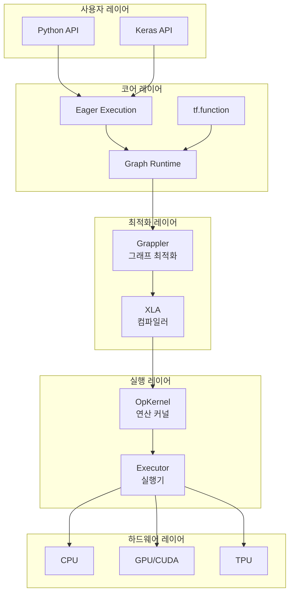
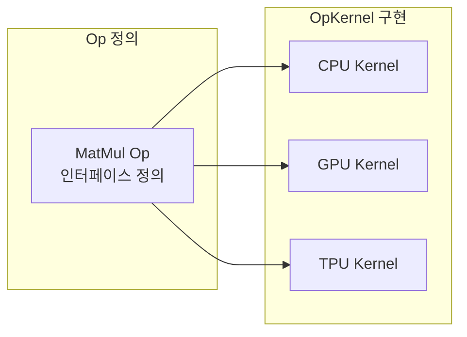
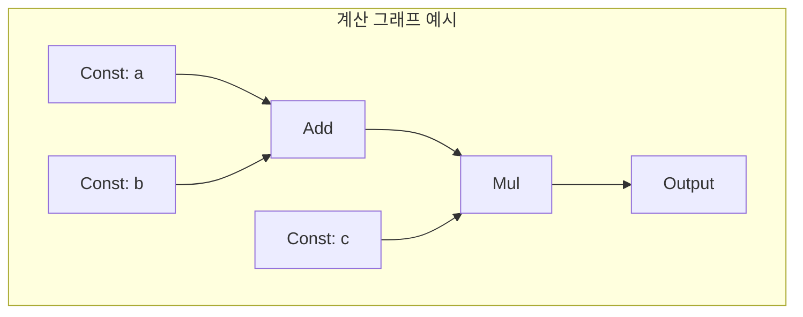
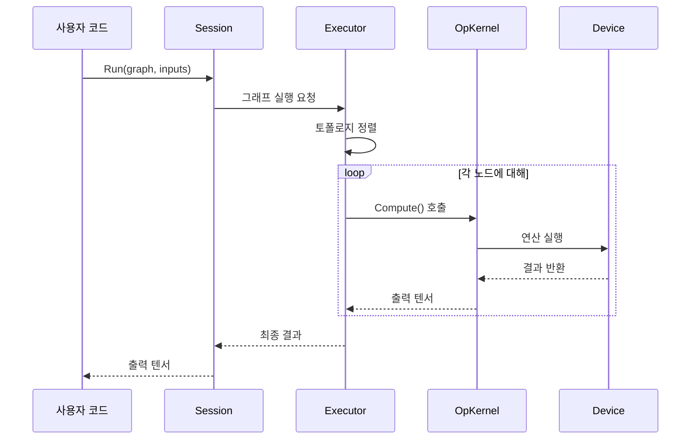
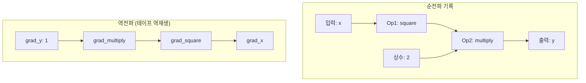
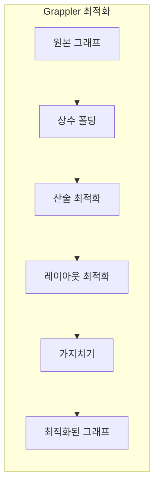
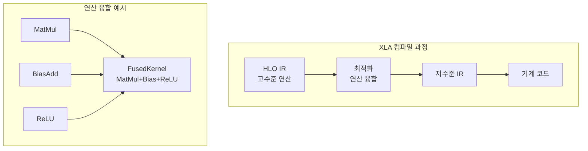
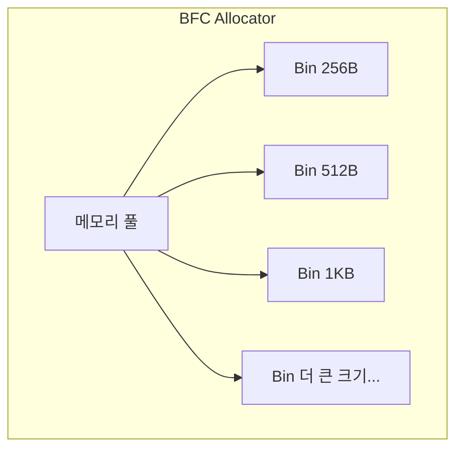
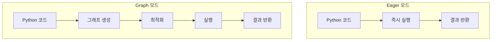
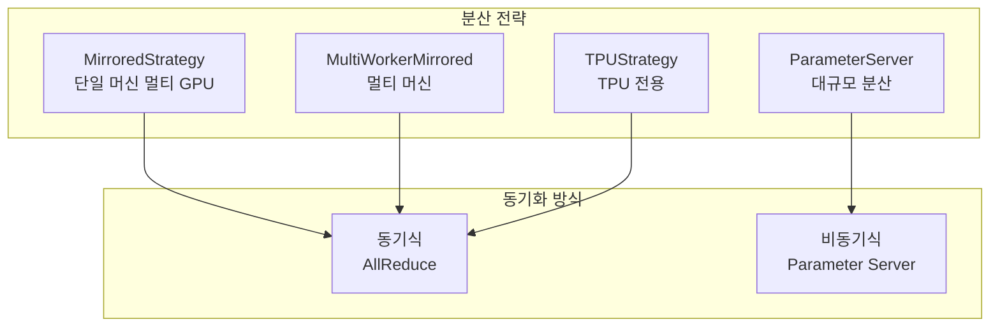

# 아키텍처 개요

TensorFlow의 내부 구조를 이해하면 더 효율적인 코드를 작성할 수 있습니다. 이 문서에서는 TensorFlow가 어떻게 동작하는지 깊이 있게 살펴봅니다.

## 전체 아키텍처



---

## 핵심 컴포넌트

### 1. 텐서 (Tensor)

텐서는 TensorFlow의 기본 데이터 단위입니다.

**소스 코드 위치**: `tensorflow/core/framework/tensor.h`

```cpp
// 간략화된 Tensor 클래스 구조
class Tensor {
 public:
  DataType dtype() const;      // 데이터 타입
  TensorShape shape() const;   // 형상
  int dims() const;            // 차원 수
  int64 NumElements() const;   // 총 요소 수

  // 데이터 접근
  template<typename T>
  T* flat();                   // 1D 뷰로 접근

 private:
  TensorBuffer* buf_;          // 실제 데이터 버퍼
  TensorShape shape_;          // 형상 정보
  DataType dtype_;             // 데이터 타입
};
```

**핵심 포인트**:
- 텐서는 **메타데이터**(shape, dtype)와 **데이터 버퍼**로 구성
- 데이터 버퍼는 참조 카운팅으로 관리 (복사 시 공유 가능)
- Device 간 이동 시 새 버퍼 할당

---

### 2. 연산 (Operation/OpKernel)

모든 계산은 Op(연산)과 OpKernel(구현체)로 정의됩니다.



**소스 코드 위치**: `tensorflow/core/kernels/`

```cpp
// Op 등록 예시 (간략화)
REGISTER_OP("MatMul")
    .Input("a: T")
    .Input("b: T")
    .Output("product: T")
    .Attr("T: {float, double, int32}")
    .Attr("transpose_a: bool = false")
    .Attr("transpose_b: bool = false");

// Kernel 구현 예시
class MatMulOp : public OpKernel {
 public:
  void Compute(OpKernelContext* ctx) override {
    const Tensor& a = ctx->input(0);
    const Tensor& b = ctx->input(1);

    // 행렬 곱셈 수행
    Tensor* output;
    ctx->allocate_output(0, output_shape, &output);

    // BLAS 라이브러리 호출
    LaunchMatMul(ctx, a, b, output);
  }
};
```

---

### 3. 그래프 (Graph)

연산들의 의존성을 표현하는 방향성 비순환 그래프(DAG)입니다.



**Python에서 그래프 생성**:

```python
import tensorflow as tf

@tf.function
def compute(a, b, c):
    temp = a + b
    return temp * c

# 그래프 추출
concrete_fn = compute.get_concrete_function(
    tf.TensorSpec(shape=(), dtype=tf.float32),
    tf.TensorSpec(shape=(), dtype=tf.float32),
    tf.TensorSpec(shape=(), dtype=tf.float32)
)

# 그래프 내 연산 확인
for op in concrete_fn.graph.get_operations():
    print(op.name, op.type)
```

---

### 4. Executor (실행기)

그래프를 실제로 실행하는 컴포넌트입니다.

**소스 코드 위치**: `tensorflow/core/common_runtime/executor.cc`



**실행 순서 결정**:
1. 그래프를 토폴로지 정렬
2. 입력이 준비된 노드부터 실행
3. 병렬 실행 가능한 노드는 동시 실행

---

### 5. GradientTape (자동 미분)

연산을 기록하여 역전파를 수행합니다.

**소스 코드 위치**: `tensorflow/python/eager/backprop.py`



```python
import tensorflow as tf

x = tf.Variable(3.0)

# 순전파: 연산 기록
with tf.GradientTape() as tape:
    y = tf.square(x)  # Op1: square
    z = y * 2         # Op2: multiply

# 역전파: 테이프 역재생
dz_dx = tape.gradient(z, x)
print(dz_dx.numpy())  # 12.0 = 2 * 2 * 3
```

**내부 동작**:
1. `tape.watch(variable)`: 변수를 감시 대상에 추가
2. 각 연산마다 **그래디언트 함수** 등록
3. `tape.gradient()` 호출 시 역순으로 그래디언트 함수 실행

---

## 최적화 파이프라인

### Grappler (그래프 최적화)

실행 전 그래프를 최적화합니다.

**소스 코드 위치**: `tensorflow/core/grappler/`



**최적화 종류**:

| 최적화 | 설명 | 예시 |
|--------|------|------|
| Constant Folding | 상수 연산 미리 계산 | `2 * 3` → `6` |
| Arithmetic | 산술 단순화 | `x * 1` → `x` |
| Layout | 메모리 레이아웃 최적화 | NHWC ↔ NCHW |
| Pruning | 불필요한 노드 제거 | 미사용 출력 제거 |

---

### XLA (Accelerated Linear Algebra)

연산을 융합하고 하드웨어 특화 코드를 생성합니다.

**소스 코드 위치**: `tensorflow/compiler/xla/`



**XLA 활성화**:

```python
@tf.function(jit_compile=True)
def xla_compute(x, y, z):
    return tf.nn.relu(tf.matmul(x, y) + z)
```

**XLA의 장점**:
- 메모리 대역폭 감소 (중간 결과 저장 불필요)
- 커널 호출 오버헤드 감소
- 하드웨어 특화 최적화

---

## 메모리 관리

### BFC Allocator

TensorFlow의 GPU 메모리 할당기입니다.

**소스 코드 위치**: `tensorflow/core/common_runtime/bfc_allocator.cc`



**특징**:
- GPU 메모리를 미리 할당하여 풀로 관리
- Best-Fit 전략으로 메모리 단편화 최소화
- 빈(Bin)별로 비슷한 크기의 청크 관리

**메모리 사용량 확인**:

```python
# GPU 메모리 증가 허용
gpus = tf.config.experimental.list_physical_devices('GPU')
if gpus:
    tf.config.experimental.set_memory_growth(gpus[0], True)

# 메모리 사용량 확인
tf.config.experimental.get_memory_info('GPU:0')
```

---

## 실행 모드 비교

### Eager vs Graph 모드



| 측면 | Eager | Graph |
|------|-------|-------|
| 디버깅 | 쉬움 | 어려움 |
| 성능 | 낮음 | 높음 |
| 최적화 | 제한적 | 전체 그래프 최적화 |
| Python 제어 흐름 | 지원 | AutoGraph 필요 |

---

## 분산 학습 아키텍처

### 전략 패턴



**코드 예시**:

```python
# 멀티 GPU 학습
strategy = tf.distribute.MirroredStrategy()

with strategy.scope():
    model = tf.keras.Sequential([
        tf.keras.layers.Dense(128, activation='relu'),
        tf.keras.layers.Dense(10)
    ])
    model.compile(optimizer='adam', loss='sparse_categorical_crossentropy')

# 자동으로 데이터와 연산 분산
model.fit(train_dataset, epochs=10)
```

---

## 핵심 소스 파일 위치

| 컴포넌트 | 경로 |
|----------|------|
| Tensor | `tensorflow/core/framework/tensor.h` |
| OpKernel | `tensorflow/core/framework/op_kernel.h` |
| Graph | `tensorflow/core/graph/graph.h` |
| Executor | `tensorflow/core/common_runtime/executor.cc` |
| GradientTape | `tensorflow/python/eager/backprop.py` |
| Grappler | `tensorflow/core/grappler/` |
| XLA | `tensorflow/compiler/xla/` |
| BFC Allocator | `tensorflow/core/common_runtime/bfc_allocator.cc` |
