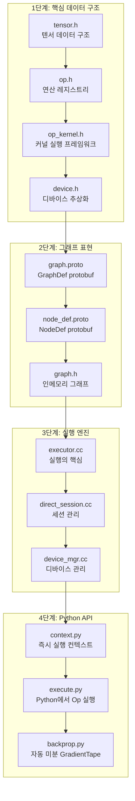
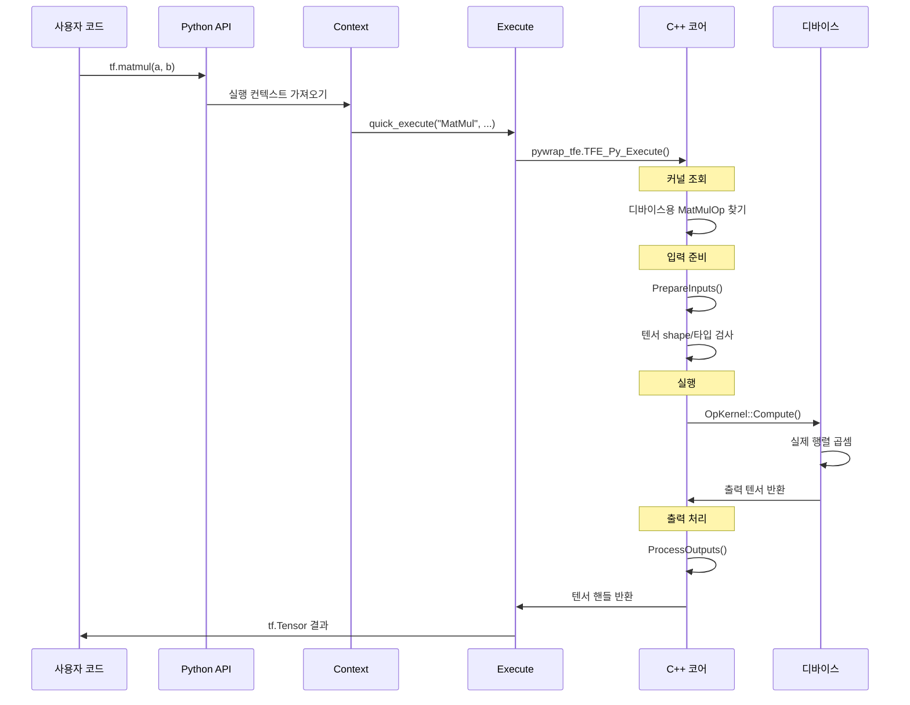

# 코드 읽기 순서

TensorFlow 소스 코드를 효과적으로 읽기 위한 가이드입니다. 처음 접하는 개발자를 위해 파일별 설명과 읽기 순서를 제공합니다.

## 권장 읽기 순서



---

## 1단계: 핵심 데이터 구조

### 1.1 Tensor (tensor.h)

**위치**: `/tensorflow/core/framework/tensor.h`

**역할**: TensorFlow의 가장 기본적인 데이터 컨테이너

**핵심 코드 설명**:

```cpp
// tensor.h - 핵심 구조 (116-120줄)
class Tensor {
 public:
  // 기본 생성자 - 1차원, 0개 요소, float 텐서 생성
  // 패턴: 안전한 초기화를 가진 기본 생성자
  Tensor();

  // 메인 생성자 - 가장 자주 사용됨
  // 지정된 타입과 shape의 텐서 생성
  // 메모리 할당에 CPUAllocator를 기본으로 사용
  Tensor(DataType type, const TensorShape& shape);

  // 커스텀 할당기를 사용하는 생성자 (GPU 메모리 등)
  // 패턴: 의존성 주입 - 할당 전략 교체 가능
  Tensor(Allocator* a, DataType type, const TensorShape& shape);
```

**중요 데이터 멤버 (717-718줄)**:
```cpp
private:
  TensorShape shape_;    // 차원과 데이터 타입 저장 (효율성을 위해 패킹)
  TensorBuffer* buf_;    // 실제 데이터 버퍼에 대한 참조 카운트 포인터
```

**설계 패턴: 참조 카운팅 (RAII)**:
```cpp
// 1024-1027줄 - 복사 생성자가 참조 카운팅 사용
inline Tensor::Tensor(const Tensor& other)
    : shape_(other.shape()), buf_(other.buf_) {
  if (buf_) buf_->Ref();  // 참조 카운트 증가, 버퍼 공유
}
```

**왜 중요한가요?**:
- 텐서들이 기반 버퍼를 공유할 수 있음 (메모리 효율적)
- 복사가 O(1) 연산 (참조 카운트만 증가)
- 마지막 참조가 해제될 때 자동으로 메모리 해제

---

### 1.2 OpKernel (op_kernel.h)

**위치**: `/tensorflow/core/framework/op_kernel.h`

**역할**: 모든 연산 구현의 베이스 클래스

**핵심 코드 설명**:

```cpp
// op_kernel.h - 106-228줄

class OpKernel {
 public:
  // 생성자가 OpKernelConstruction 컨텍스트를 받음
  // 패턴: 2단계 초기화 (컨텍스트가 필요한 모든 정보 제공)
  explicit OpKernel(OpKernelConstruction* context);

  // 핵심 메서드 - 모든 op이 구현해야 함
  // 순수 가상 - 서브클래스에서 구현 강제
  // 패턴: 템플릿 메서드 - 알고리즘 골격 정의
  virtual void Compute(OpKernelContext* context) = 0;

  // 비동기 연산을 위한 비동기 변형 (GPU, 네트워크)
  virtual AsyncOpKernel* AsAsync() { return nullptr; }

  // 성능 힌트 - 스케줄러가 인라인 vs 스레드풀 결정에 도움
  virtual bool IsExpensive() { return expensive_; }
```

**커널 등록 패턴 (1499-1501줄)**:
```cpp
// 매크로가 커널을 등록하는 정적 초기화로 확장
#define REGISTER_KERNEL_BUILDER(kernel_builder, ...) \
  TF_ATTRIBUTE_ANNOTATE("tf:kernel")                 \
  REGISTER_KERNEL_BUILDER_IMPL(kernel_builder, false, __VA_ARGS__)

// 사용 예시:
// REGISTER_KERNEL_BUILDER(Name("MatMul").Device(DEVICE_CPU), MatMulOp);
```

**설계 패턴: 팩토리 레지스트리**:
- 연산들이 정적 초기화 시에 등록됨
- 런타임이 op 이름 + 디바이스 타입으로 적절한 커널 조회
- 명시적인 if/else 체인 없이 다형성 가능

---

### 1.3 OpKernelContext (op_kernel.h)

**역할**: 커널 실행 환경

**핵심 코드 설명 (571-1345줄)**:

```cpp
class OpKernelContext {
 public:
  // 중첩 Params 구조체 - 커널이 필요로 하는 모든 것 포함
  // 패턴: 파라미터 객체 - 관련 파라미터 그룹화
  struct Params {
    int64_t step_id = 0;                    // 고유 실행 스텝 ID
    OpKernel* op_kernel = nullptr;          // 실행 중인 커널
    DeviceBase* device = nullptr;           // 타겟 디바이스 (CPU/GPU)
    absl::Span<const TensorValue> inputs;   // 입력 텐서들
    RendezvousInterface* rendezvous;        // 디바이스 간 통신
    CancellationManager* cancellation_manager;  // 비동기 취소용
    // ... 더 많은 필드
  };

  // 기본 입력 접근
  // 인덱스에 있는 입력 텐서에 대한 불변 참조 반환
  const Tensor& input(int index) const;

  // 기본 출력 할당
  // 출력용 텐서 할당, 포인터 반환
  // 패턴: 지연 할당 - 필요할 때만 메모리 할당
  virtual absl::Status allocate_output(int index, const TensorShape& shape,
                                       Tensor** tensor);

  // 임시 메모리 (계산 중 스크래치 공간)
  virtual absl::Status allocate_temp(DataType type, const TensorShape& shape,
                                     Tensor* out_temp);
```

**메모리 관리 패턴 - 입력 포워딩 (902-905줄)**:
```cpp
// 고급 최적화: 입력 버퍼를 출력으로 재사용
// 입력 텐서가 더 이상 필요 없을 때 메모리 할당 회피
std::unique_ptr<Tensor> forward_input(
    int input_index, int output_index, DataType output_dtype,
    const TensorShape& output_shape, MemoryType output_memory_type,
    const AllocatorAttributes& output_attr);
```

---

## 2단계: 그래프 표현

### 2.1 GraphDef Protobuf

**위치**: `/tensorflow/core/framework/graph.proto`

**역할**: 직렬화 가능한 그래프 표현

```protobuf
// 직렬화 가능한 그래프 표현
message GraphDef {
  repeated NodeDef node = 1;           // 그래프의 모든 연산
  VersionDef versions = 4;             // 호환성 버전 정보
  FunctionDefLibrary library = 2;      // 사용자 정의 함수
  GraphDebugInfo debug_info = 5;       // 디버깅용 스택 트레이스
}
```

### 2.2 NodeDef Protobuf

**위치**: `/tensorflow/core/framework/node_def.proto`

```protobuf
message NodeDef {
  string name = 1;          // 고유 식별자, 예: "dense/MatMul"
  string op = 2;            // 연산 타입, 예: "MatMul"
  repeated string input = 3; // 의존성: "node:output_index" 형식
  string device = 4;        // 배치 힌트, 예: "/device:GPU:0"
  map<string, AttrValue> attr = 5;  // Op별 설정
}
```

### 2.3 Graph (graph.h)

**위치**: `/tensorflow/core/graph/graph.h`

**역할**: 인메모리 그래프 표현

```cpp
// graph.h - 85-200줄

class Node {
 public:
  int id() const { return id_; }              // 그래프 내 고유
  const std::string& name() const;            // 사용자 가시 이름
  const std::string& type_string() const;     // 연산 타입 (예: "MatMul")

  // 노드 정의 (protobuf) - 속성에 대한 권위 있는 소스
  const NodeDef& def() const;
  const OpDef& op_def() const;

  // 타입 검사를 위한 입력/출력 타입
  int32_t num_inputs() const;
  DataType input_type(int32_t i) const;

  // 그래프 연결성
  const EdgeSet& in_edges() const { return in_edges_; }
  const EdgeSet& out_edges() const { return out_edges_; }

  // 제어 흐름 처리를 위한 노드 분류
  bool IsSwitch() const { return class_ == NC_SWITCH; }
  bool IsMerge() const { return class_ == NC_MERGE; }
  bool IsEnter() const { return class_ == NC_ENTER; }
  // ... 더 많은 타입 검사
};
```

---

## 3단계: 실행 엔진

### 3.1 Executor (executor.cc)

**위치**: `/tensorflow/core/common_runtime/executor.cc`

**역할**: 계산 그래프에서 연산 스케줄링 및 실행

**핵심 코드 설명 (148-231줄)**:

```cpp
class ExecutorImpl : public Executor {
 public:
  explicit ExecutorImpl(const LocalExecutorParams& p) : immutable_state_(p) {}

  absl::Status Initialize(const Graph& graph) {
    // 단계 1: 그래프에서 불변 상태 빌드
    TF_RETURN_IF_ERROR(immutable_state_.Initialize(graph));
    // 단계 2: 스케줄링을 위한 커널 비용 통계 초기화
    kernel_stats_.Initialize(immutable_state_.graph_view());
    return absl::OkStatus();
  }

 private:
  // 커널에 대한 동적 비용 추정
  // 패턴: 적응형 알고리즘 - 런타임 동작 기반으로 조정
  class KernelStats {
    // 초기 가정: op들이 비쌈 (1억 사이클)
    static constexpr uint64_t kInitialCostEstimateCycles = 100 * 1000 * 1000;

    // "비쌈" 분류 임계값 (8000 사이클)
    static constexpr uint64_t kOpIsExpensiveThresholdCycles = 8000;

    // 커널이 인라인 또는 스레드풀에서 실행될지 결정
    bool IsExpensive(const NodeItem& node) const {
      return is_expensive_[node.node_id] &&
             (cost_estimates_[node.node_id].load() > kOpIsExpensiveThresholdCycles);
    }

    // 실행 시간의 이동 평균 업데이트
    // 패턴: 지수 이동 평균
    void UpdateCostEstimate(const NodeItem& node, uint64_t elapsed_cycles) {
      uint64_t new_estimate =
          ((kCostDecay - 1) * prev_estimate + elapsed_cycles) / kCostDecay;
      cost_estimate.store(new_estimate);
    }
  };
};
```

**ExecutorState - 호출별 상태 (283-418줄)**:
```cpp
template <class PropagatorStateType>
class ExecutorState {
  // 핵심 실행 루프
  void Process(const TaggedNode& node, int64_t scheduled_nsec);

  // 동기 vs 비동기 커널 실행 분리
  absl::Status ProcessSync(const NodeItem& item, ...);   // 블로킹
  void ProcessAsync(const NodeItem& item, ...);          // 논블로킹

  // 입력 준비 - 엣지에서 TensorValue 배열 채우기
  absl::Status PrepareInputs(const NodeItem& item, ...);

  // 출력 처리 - 결과를 다운스트림 노드로 전파
  absl::Status ProcessOutputs(const NodeItem& item, ...);

  // 스케줄링 결정 - 저렴한 op은 인라인, 비싼 op은 스레드풀
  void ScheduleReady(TaggedNodeSeq* ready, TaggedNodeReadyQueue* inline_ready);
};
```

---

## 4단계: Python API

### 4.1 Context (context.py)

**위치**: `/tensorflow/python/eager/context.py`

**역할**: 즉시 실행 컨텍스트 관리

```python
# context.py - 55-58줄

GRAPH_MODE = 0    # TF1 스타일: 그래프 빌드, 나중에 실행
EAGER_MODE = 1    # TF2 스타일: 즉시 실행

# 기본 모드는 TF 버전에 따라 다름
default_execution_mode = EAGER_MODE if tf2.enabled() else GRAPH_MODE
```

### 4.2 Execute (execute.py)

**위치**: `/tensorflow/python/eager/execute.py`

**역할**: Python에서 TensorFlow 연산 실행

```python
# execute.py - 28-67줄

def quick_execute(op_name, num_outputs, inputs, attrs, ctx, name=None):
  """TensorFlow 연산 실행.

  즉시 모드에서 op을 실행하는 진입점입니다.

  Args:
    op_name: TensorFlow 연산 이름 (REGISTER_OP에서)
    num_outputs: 출력 개수 (성능을 위해 미리 알려짐)
    inputs: 입력 텐서 리스트
    attrs: 평탄화된 (attr_name, attr_value) 쌍 리스트
    ctx: 즉시 실행 컨텍스트

  흐름:
    1. ctx.ensure_initialized() - 필요시 TF 런타임 초기화
    2. pywrap_tfe.TFE_Py_Execute() - Python 바인딩 통해 C++ 호출
    3. 출력 텐서 반환
  """
  device_name = ctx.device_name
  try:
    ctx.ensure_initialized()
    # 핵심 호출 - Python/C++ 경계 넘어감
    tensors = pywrap_tfe.TFE_Py_Execute(
        ctx._handle, device_name, op_name, inputs, attrs, num_outputs)
  except core._NotOkStatusException as e:
    # 컨텍스트 보강한 에러 처리
    if name is not None:
      e.message += " name: " + name
    raise core._status_to_exception(e) from None
  return tensors
```

### 4.3 GradientTape (backprop.py)

**위치**: `/tensorflow/python/eager/backprop.py`

**역할**: 자동 미분을 위한 연산 기록

```python
# backprop.py - 705-848줄

class GradientTape:
  """자동 미분을 위해 연산을 기록합니다.

  패턴: 컨텍스트 매니저 + 옵저버 패턴
  - 실행되는 연산들을 기록
  - 즉석에서 역방향 자동미분 그래프 빌드
  """

  def __init__(self, persistent=False, watch_accessed_variables=True):
    """
    Args:
      persistent: True면 테이프가 그래디언트를 여러 번 계산 가능
                  False면 첫 gradient() 호출 후 테이프 소비됨
      watch_accessed_variables: 학습 가능한 변수 자동 감시
    """
    self._tape = None
    self._persistent = persistent
    self._watch_accessed_variables = watch_accessed_variables
    self._recording = False

  def __enter__(self):
    """연산 기록 시작."""
    self._push_tape()  # 전역 테이프 스택에 푸시
    return self

  def __exit__(self, typ, value, traceback):
    """기록 중지."""
    if self._recording:
      self._pop_tape()

  def watch(self, tensor):
    """텐서를 그래디언트 추적 대상으로 수동 표시."""
    # 감시 세트에 텐서 추가
    # 이 텐서에 대해 그래디언트 계산됨
    pass  # C++에서 구현

  def gradient(self, target, sources, ...):
    """sources에 대한 target의 그래디언트 계산.

    역방향 자동 미분 사용:
    1. 기록된 op들을 역순으로 재생
    2. 각 단계에서 연쇄 법칙 적용
    3. source 텐서들에 대한 그래디언트 반환
    """
    pass  # C++ 테이프 호출
```

---

## 데이터 흐름 다이어그램



---

## 설계 패턴 요약

| 패턴 | 위치 | 목적 |
|------|------|------|
| **팩토리 레지스트리** | `op.h`, `op_kernel.h` | 시작 시 ops/kernels 등록, 이름으로 조회 |
| **템플릿 메서드** | `OpKernel::Compute()` | 계산 골격 정의, 서브클래스가 채움 |
| **옵저버** | `GradientTape` | 실행되는 연산 기록 |
| **컨텍스트 매니저** | `GradientTape.__enter__/__exit__` | 리소스 수명주기 관리 |
| **참조 카운팅** | `Tensor`, `TensorBuffer` | 복사 없이 공유 소유권 |
| **의존성 주입** | `Allocator*` 파라미터 | 메모리 전략 교체 (CPU/GPU) |
| **파라미터 객체** | `OpKernelContext::Params` | 관련 실행 파라미터 그룹화 |
| **지연 할당** | `allocate_output()` | 필요할 때까지 메모리 할당 지연 |
| **적응형 알고리즘** | `KernelStats` | 런타임 비용 기반으로 스케줄링 조정 |

---

## 코드 리더를 위한 핵심 인사이트

1. **Tensor는 가볍습니다**: `Tensor` 클래스 자체는 작습니다. 실제 데이터는 참조 카운트되고 공유되는 `TensorBuffer`에 있습니다.

2. **등록은 정적입니다**: Ops와 커널은 정적 초기화기를 통해 프로그램 시작 시 자동 등록됩니다. 명시적 구성 없이 팩토리 패턴 가능.

3. **실행은 데이터플로우 기반입니다**: 실행기는 고정된 순서로 노드를 실행하지 않습니다. 입력이 준비되면 노드를 발화합니다 (위상적 실행).

4. **비용 추정은 적응적입니다**: 스케줄러가 런타임에 어떤 op이 비싼지 학습하여, 비싼 것은 스레드풀로 보내고 저렴한 것은 인라인 실행합니다.

5. **Python/C++ 경계**: `pywrap_tfe.TFE_Py_Execute()`가 중요한 브릿지입니다. 대부분의 성능 크리티컬 코드는 C++입니다.

6. **GradientTape는 기록하고 변환하지 않습니다**: 일부 AD 시스템과 달리, TensorFlow의 테이프는 연산 메타데이터를 기록하고 `gradient()` 동안 역방향으로 재생합니다.

7. **디바이스 추상화**: `Device` 클래스가 CPU, GPU, TPU 등을 위한 통일된 인터페이스를 제공합니다. 커널은 디바이스 타입별로 특화될 수 있습니다.
