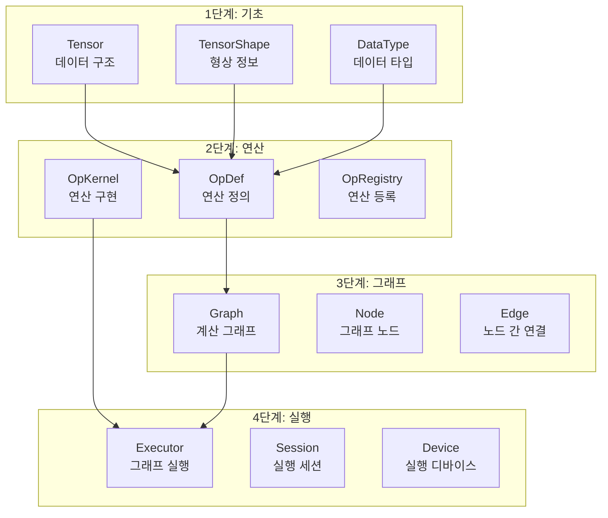
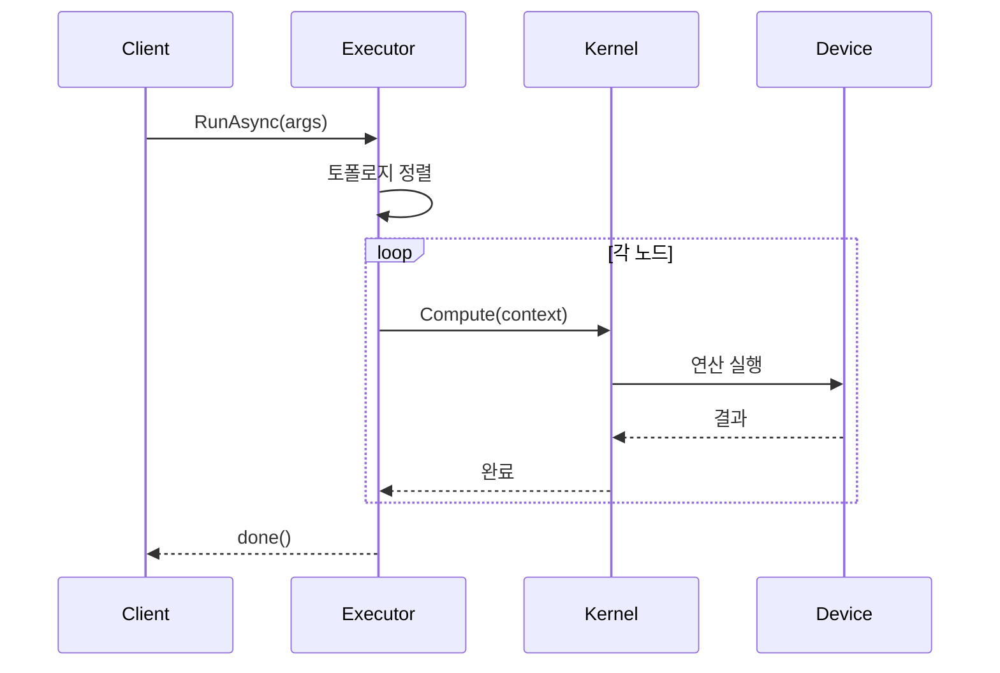

# 코드 읽기 순서

TensorFlow 소스 코드를 효과적으로 읽기 위한 가이드입니다. 핵심 컴포넌트부터 시작하여 점진적으로 깊이 들어갑니다.

## 권장 읽기 순서



---

## 1단계: 기초 데이터 구조

### Tensor (텐서)

**파일**: `tensorflow/core/framework/tensor.h`

```cpp
// 핵심 구조 (간략화)
class Tensor {
 public:
  // 생성자
  Tensor();
  Tensor(DataType type, const TensorShape& shape);

  // 속성 접근
  DataType dtype() const { return shape_.data_type(); }
  const TensorShape& shape() const { return shape_; }
  int dims() const { return shape_.dims(); }
  int64_t dim_size(int d) const { return shape_.dim_size(d); }
  int64_t NumElements() const { return shape_.num_elements(); }

  // 데이터 접근
  template <typename T>
  typename TTypes<T>::Flat flat() {
    return shaped<T, 1>({NumElements()});
  }

 private:
  TensorShape shape_;
  TensorBuffer* buf_;  // 실제 데이터
};
```

**핵심 포인트**:
- `TensorBuffer`: 참조 카운팅되는 데이터 버퍼
- `flat()`: 1D 뷰로 데이터 접근
- Device-specific 버퍼 (CPU/GPU)

---

### TensorShape (형상)

**파일**: `tensorflow/core/framework/tensor_shape.h`

```cpp
class TensorShape {
 public:
  TensorShape();
  TensorShape(std::initializer_list<int64_t> dim_sizes);

  int dims() const;
  int64_t dim_size(int d) const;
  int64_t num_elements() const;

  void AddDim(int64_t size);
  void InsertDim(int d, int64_t size);
  void RemoveDim(int d);

 private:
  // 최적화: 작은 shape은 인라인 저장
  union {
    int64_t dims_[4];  // 4차원까지 인라인
    int64_t* dims_ptr_;  // 더 큰 경우 힙 할당
  };
};
```

---

## 2단계: 연산 시스템

### OpDef (연산 정의)

**파일**: `tensorflow/core/framework/op_def.proto`

```protobuf
message OpDef {
  string name = 1;

  message ArgDef {
    string name = 1;
    string type_attr = 2;
    DataType type = 3;
  }

  repeated ArgDef input_arg = 2;
  repeated ArgDef output_arg = 3;

  message AttrDef {
    string name = 1;
    string type = 2;
    AttrValue default_value = 3;
  }

  repeated AttrDef attr = 4;
}
```

**연산 등록 예시** (`tensorflow/core/ops/math_ops.cc`):

```cpp
REGISTER_OP("Add")
    .Input("x: T")
    .Input("y: T")
    .Output("z: T")
    .Attr("T: {half, float, double, int32, int64}")
    .SetShapeFn([](InferenceContext* c) {
      return shape_inference::BroadcastBinaryOpShapeFn(c);
    });
```

---

### OpKernel (연산 구현)

**파일**: `tensorflow/core/framework/op_kernel.h`

```cpp
class OpKernel {
 public:
  explicit OpKernel(OpKernelConstruction* context);
  virtual ~OpKernel();

  // 연산 실행 (순수 가상 함수)
  virtual void Compute(OpKernelContext* context) = 0;

  const string& name() const { return def_.name(); }
  DataType input_type(int i) const;
  DataType output_type(int o) const;

 protected:
  const NodeDef& def_;
};
```

**Kernel 등록 예시** (`tensorflow/core/kernels/cwise_op_add.cc`):

```cpp
// CPU 커널
REGISTER_KERNEL_BUILDER(
    Name("Add").Device(DEVICE_CPU).TypeConstraint<float>("T"),
    BinaryOp<CPUDevice, functor::add<float>>);

// GPU 커널
REGISTER_KERNEL_BUILDER(
    Name("Add").Device(DEVICE_GPU).TypeConstraint<float>("T"),
    BinaryOp<GPUDevice, functor::add<float>>);
```

---

## 3단계: 그래프

### Graph (계산 그래프)

**파일**: `tensorflow/core/graph/graph.h`

```cpp
class Graph {
 public:
  Graph(const OpRegistryInterface* registry);

  // 노드 추가
  Node* AddNode(NodeDef node_def, Status* status);

  // 노드 순회
  gtl::iterator_range<NodeIter> nodes() const;
  gtl::iterator_range<NodeIter> op_nodes() const;

  // 특수 노드
  Node* source_node() const { return FindNodeId(kSourceId); }
  Node* sink_node() const { return FindNodeId(kSinkId); }

  int num_nodes() const { return num_nodes_; }
  int num_edges() const { return num_edges_; }

 private:
  std::vector<Node*> nodes_;
  std::vector<Edge*> edges_;
  int num_nodes_;
  int num_edges_;
};
```

---

### Node (그래프 노드)

**파일**: `tensorflow/core/graph/graph.h`

```cpp
class Node {
 public:
  int id() const { return id_; }
  const string& name() const { return def_.name(); }
  const string& type_string() const { return def_.op(); }

  // 입출력 엣지
  gtl::iterator_range<NeighborIter> in_nodes() const;
  gtl::iterator_range<NeighborIter> out_nodes() const;

  int num_inputs() const;
  int num_outputs() const;

  // 속성
  const AttrValue* attrs() const;

 private:
  int id_;
  NodeDef def_;
  std::vector<Edge*> in_edges_;
  std::vector<Edge*> out_edges_;
};
```

---

## 4단계: 실행 시스템

### Executor (실행기)

**파일**: `tensorflow/core/common_runtime/executor.cc`

```cpp
class ExecutorImpl : public Executor {
 public:
  void RunAsync(const Args& args, DoneCallback done) override;

 private:
  // 토폴로지 정렬된 노드 순서
  std::vector<const NodeItem*> nodes_;

  // 노드 실행
  void Process(TaggedNode node, int64_t scheduled_nsec);

  // 완료 콜백
  void NodeDone(const Status& s, TaggedNode node);
};
```

**실행 흐름**:



---

## Python 바인딩

### Eager Execution

**파일**: `tensorflow/python/eager/execute.py`

```python
def execute(op_name, num_outputs, inputs, attrs, ctx, name=None):
    """Op를 즉시 실행"""
    try:
        # C API 호출
        tensors = pywrap_tfe.TFE_Py_Execute(
            ctx._handle, device_name, op_name, inputs, attrs, num_outputs
        )
        return tensors
    except core._NotOkStatusException as e:
        raise _make_exception(e)
```

---

### GradientTape

**파일**: `tensorflow/python/eager/backprop.py`

```python
class GradientTape:
    def __init__(self, persistent=False, watch_accessed_variables=True):
        self._tape = None
        self._persistent = persistent
        self._watch_accessed_variables = watch_accessed_variables

    def __enter__(self):
        self._tape = tape_lib.push_new_tape(
            persistent=self._persistent,
            watch_accessed_variables=self._watch_accessed_variables
        )
        return self

    def __exit__(self, typ, value, traceback):
        tape_lib.pop_tape(self._tape)

    def watch(self, tensor):
        """텐서를 감시 대상에 추가"""
        tape_lib.watch(self._tape, tensor)

    def gradient(self, target, sources):
        """그래디언트 계산"""
        return imperative_grad.imperative_grad(
            self._tape, target, sources
        )
```

---

## 핵심 디렉토리 구조

```
tensorflow/
├── core/                    # C++ 핵심 라이브러리
│   ├── framework/          # 기본 추상화 (Tensor, Op, Graph)
│   ├── graph/              # 그래프 구성 및 변환
│   ├── kernels/            # Op 커널 구현
│   ├── common_runtime/     # 실행 런타임
│   └── platform/           # 플랫폼 추상화
│
├── python/                  # Python API
│   ├── framework/          # Python 프레임워크
│   ├── eager/              # Eager execution
│   ├── ops/                # Python Op 래퍼
│   └── keras/              # Keras 통합
│
├── compiler/                # 컴파일러
│   └── xla/                # XLA 컴파일러
│
└── tools/                   # 개발 도구
```

---

## 읽기 팁

### 1. 헤더 파일 먼저

```cpp
// tensor.h를 읽으면 Tensor의 인터페이스를 파악
class Tensor {
  DataType dtype() const;
  TensorShape shape() const;
  // ...
};
```

### 2. 등록 매크로 따라가기

```cpp
// REGISTER_OP, REGISTER_KERNEL_BUILDER 검색
REGISTER_OP("MatMul")...  // Op 정의 찾기
REGISTER_KERNEL_BUILDER(Name("MatMul")...) // 구현 찾기
```

### 3. 테스트 코드 참조

```
tensorflow/core/kernels/matmul_op_test.cc  # 사용 예시 확인
```

### 4. Python에서 C++로

```python
# Python API
tf.matmul(a, b)
↓
# gen_math_ops.py (자동 생성)
↓
# C API (pywrap_tensorflow)
↓
# C++ Kernel
tensorflow/core/kernels/matmul_op.cc
```

---

## 추천 학습 경로

| 단계 | 목표 | 핵심 파일 |
|------|------|-----------|
| 1 | Tensor 이해 | `core/framework/tensor.h` |
| 2 | Op 시스템 이해 | `core/framework/op_kernel.h` |
| 3 | 그래프 구조 이해 | `core/graph/graph.h` |
| 4 | 실행 흐름 이해 | `core/common_runtime/executor.cc` |
| 5 | Python 바인딩 | `python/eager/backprop.py` |
| 6 | XLA 컴파일러 | `compiler/xla/service/` |

---

## 연습 문제

### 연습 1: Op 구현 찾기

```
다음 연산의 CPU 커널 구현을 찾으세요:
1. tf.nn.relu
2. tf.reduce_sum
3. tf.matmul

힌트: tensorflow/core/kernels/ 디렉토리 검색
```

### 연습 2: 실행 흐름 추적

```python
import tensorflow as tf

@tf.function
def simple_fn(x):
    return x * x + x

# 이 함수가 실행될 때의 코드 흐름을 추적하세요:
# 1. Python → C++ 전환 지점
# 2. 그래프 생성 위치
# 3. 커널 실행 위치
```
