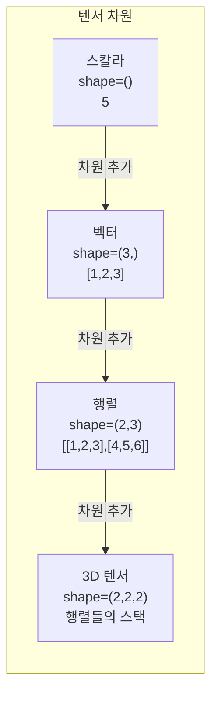
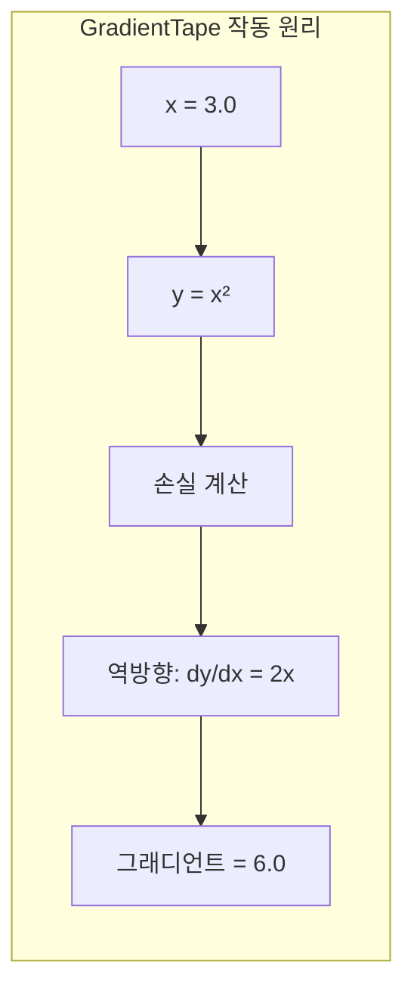
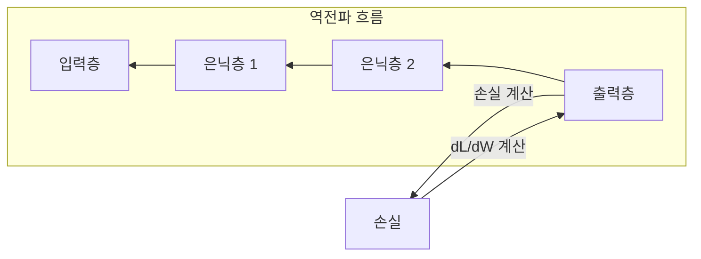
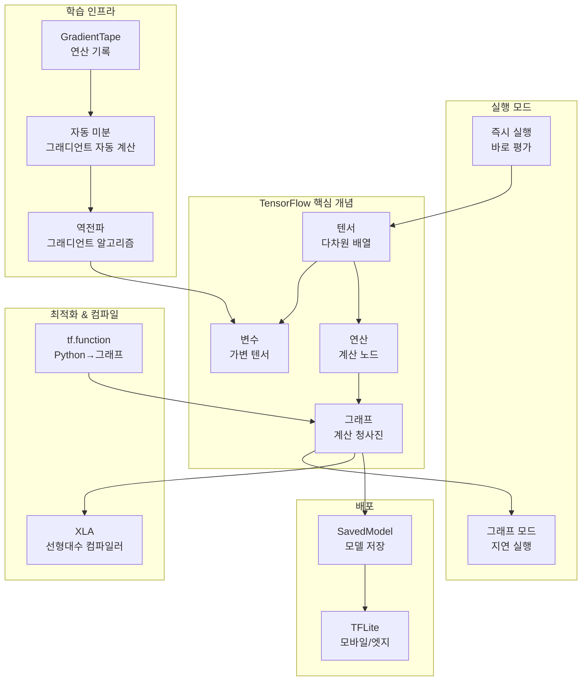

# 핵심 개념 용어집

TensorFlow를 이해하기 위한 핵심 용어들을 정리했습니다. 각 개념은 **정의**, **비유**, **예시 코드**로 설명됩니다.

## 데이터 구조

### 텐서 (Tensor)

**정의**: 텐서는 동일한 데이터 타입을 가진 다차원 배열입니다. TensorFlow의 가장 기본적인 데이터 구조입니다.

**일상적 비유**:
- **스칼라(0차원)**: 종이 위의 숫자 하나 → `5`
- **벡터(1차원)**: 한 줄로 늘어선 우편함들 → `[1, 2, 3, 4, 5]`
- **행렬(2차원)**: 엑셀 스프레드시트 → 행과 열의 숫자표
- **3차원 텐서**: 스프레드시트 여러 장을 쌓아놓은 것

**한 줄 요약**: 텐서는 TensorFlow에서 모든 데이터를 담는 다차원 컨테이너입니다.

```python
import tensorflow as tf

# 스칼라 (0차원)
scalar = tf.constant(5.0)
print(scalar.shape)  # ()

# 벡터 (1차원)
vector = tf.constant([1.0, 2.0, 3.0])
print(vector.shape)  # (3,)

# 행렬 (2차원)
matrix = tf.constant([[1, 2, 3], [4, 5, 6]])
print(matrix.shape)  # (2, 3) - 2행 3열

# 3차원 텐서
tensor_3d = tf.constant([[[1, 2], [3, 4]], [[5, 6], [7, 8]]])
print(tensor_3d.shape)  # (2, 2, 2)
```



---

### 변수 (Variable)

**정의**: 변수는 학습 중에 값이 변경될 수 있는 텐서입니다. 신경망의 가중치(weights)와 편향(bias)을 저장하는 데 사용됩니다.

**일상적 비유**:
- **일반 텐서**: 인쇄된 교과서 (고정, 변경 불가)
- **변수**: 화이트보드에 쓴 숫자 (지우고 다시 쓸 수 있음)
- 학습(training) 동안 선생님(옵티마이저)이 화이트보드 값을 업데이트합니다

**한 줄 요약**: 변수는 학습 과정에서 업데이트되는 가변적인 텐서로, 모델의 파라미터를 저장합니다.

```python
# 변수 생성
weight = tf.Variable([1.0, 2.0, 3.0])
print(weight.numpy())  # [1. 2. 3.]

# 변수 값 변경
weight.assign([4.0, 5.0, 6.0])
print(weight.numpy())  # [4. 5. 6.]

# 덧셈으로 업데이트
weight.assign_add([1.0, 1.0, 1.0])
print(weight.numpy())  # [5. 6. 7.]
```

---

## 실행 모드

### 즉시 실행 (Eager Execution)

**정의**: 즉시 실행은 연산이 정의되는 즉시 실행되는 모드입니다. TensorFlow 2.x의 기본 모드입니다.

**일상적 비유**:
- **즉시 실행**: 재료가 필요할 때마다 바로 마트에 가서 사오는 것
- 즉각적이고 직관적이지만, 매번 이동하므로 약간 비효율적일 수 있음

**한 줄 요약**: 즉시 실행은 그래프를 먼저 만들지 않고 연산을 바로 실행하여 결과를 즉시 확인할 수 있게 합니다.

```python
# 즉시 실행 - 결과가 바로 나옴
a = tf.constant(2)
b = tf.constant(3)
c = a + b
print(c)  # tf.Tensor(5, shape=(), dtype=int32)
print(c.numpy())  # 5 - 실제 값
```

---

### 그래프 모드 (Graph Mode)

**정의**: 그래프 모드는 연산을 먼저 그래프로 정의하고, 나중에 한꺼번에 실행하는 모드입니다. TensorFlow 1.x의 기본 모드였습니다.

**일상적 비유**:
- **그래프 모드**: 쇼핑 목록을 완전히 작성한 후, 마트에 한 번만 가서 모두 구매
- 효율적이지만, 목록 작성이 번거롭고 중간 확인이 어려움

**한 줄 요약**: 그래프 모드는 연산들을 계산 그래프로 먼저 정의하여 최적화 후 실행합니다.

---

### tf.function

**정의**: `tf.function`은 Python 함수를 TensorFlow 그래프로 변환하는 데코레이터입니다. 즉시 실행의 편리함과 그래프 모드의 성능을 결합합니다.

**일상적 비유**:
- 요리 레시피를 일반 언어(Python)로 작성
- 컴파일러가 이를 최적화된 기계 명령(그래프)으로 변환
- 컴파일된 버전은 원본 레시피를 한 줄씩 읽는 것보다 훨씬 빠르게 실행

**한 줄 요약**: `tf.function`은 Python 함수를 최적화된 TensorFlow 그래프로 변환하여 성능을 향상시킵니다.

```python
@tf.function
def compute(x):
    return x * x + x

# 첫 호출: 트레이싱 (그래프 생성)
result1 = compute(tf.constant(3.0))  # 약간 느림

# 이후 호출: 캐시된 그래프 재사용
result2 = compute(tf.constant(4.0))  # 매우 빠름
```

:::caution 주의: 트레이싱
`tf.function` 내부의 Python 코드(예: `print()`)는 트레이싱 시에만 실행됩니다. TensorFlow 연산만 매 호출마다 실행됩니다.

```python
@tf.function
def example():
    print("트레이싱 시에만 출력")  # 첫 호출에만 출력
    tf.print("매번 출력")         # 모든 호출에서 출력
    return tf.constant(1)
```
:::

---

## 학습 메커니즘

### GradientTape

**정의**: GradientTape는 연산을 기록하여 자동으로 그래디언트(기울기)를 계산하는 컨텍스트 매니저입니다.

**일상적 비유**:
수학 연산을 녹음하는 **카세트 테이프**를 상상하세요:
1. "녹음" 버튼 누름 - 연산 감시 시작
2. 계산 수행: x = 3, y = x * x (테이프에 기록: "y는 x에 의존, 구체적으로 y = x²")
3. "역방향 재생" - 테이프가 알려줌: "dy/dx = 2x = 6"

**한 줄 요약**: GradientTape는 연산을 기록하여 역전파에 필요한 그래디언트를 자동으로 계산합니다.

```python
x = tf.Variable(3.0)

with tf.GradientTape() as tape:
    y = x * x  # y = x²

# 그래디언트 계산: dy/dx = 2x = 6
dy_dx = tape.gradient(y, x)
print(dy_dx)  # tf.Tensor(6.0, shape=(), dtype=float32)
```



---

### 자동 미분 (Automatic Differentiation)

**정의**: 자동 미분은 연쇄 법칙(Chain Rule)을 체계적으로 적용하여 함수의 정확한 미분값을 계산하는 기법입니다.

**일상적 비유**:
최종 성적이 각 숙제에 얼마나 민감한지 추적하는 것과 같습니다:
- 최종 성적은 시험 점수에 의존
- 시험 점수는 공부 시간에 의존
- 공부 시간은 숙제 완료도에 의존
- 자동 미분은 이 연쇄를 추적하여 계산: "숙제 점수가 1점 변하면 최종 성적은 얼마나 변할까?"

**한 줄 요약**: 자동 미분은 연쇄 법칙을 사용하여 복잡한 함수의 정확한 그래디언트를 효율적으로 계산합니다.

---

### 역전파 (Backpropagation)

**정의**: 역전파는 출력층에서 입력층 방향으로 오차를 전파하며 각 가중치의 그래디언트를 계산하는 알고리즘입니다.

**일상적 비유**:
틀린 답의 **책임을 추적**하는 것과 같습니다:
- 최종 답이 틀림 (손실)
- 어떤 계산이 오차에 가장 많이 기여했나?
- 각 단계를 거슬러 올라가며 "책임" (그래디언트)을 비례적으로 할당
- 오차에 가장 많이 기여한 단계를 수정

**한 줄 요약**: 역전파는 연쇄 법칙을 사용하여 네트워크를 통해 오차를 역방향으로 전파하며 그래디언트를 계산합니다.



---

## 컴파일과 최적화

### XLA (Accelerated Linear Algebra)

**정의**: XLA는 TensorFlow 연산을 최적화하는 도메인 특화 컴파일러입니다. 연산을 융합하고, 중간 메모리 전송을 제거하며, 하드웨어 특화 코드를 생성합니다.

**일상적 비유**:
효율성을 위해 **레시피를 재구성하는 마스터 셰프**와 같습니다:
- 원래: "양파 썰기 → 볼에 담기 → 피망 썰기 → 볼에 담기 → 볼 내용물 섞기"
- XLA: "양파와 피망을 바로 팬에 썰어 넣기" (연산 융합)
- 설거지 줄임 (메모리), 요리 시간 단축 (실행)

**한 줄 요약**: XLA는 연산을 융합하고 효율적인 하드웨어 특화 코드를 생성하여 머신러닝 계산을 최적화하는 컴파일러입니다.

```python
# XLA 없이: 3개의 별도 커널 실행
def model_fn(x, y, z):
    return tf.reduce_sum(x + y * z)

# XLA 사용: 1개의 융합된 커널 실행
@tf.function(jit_compile=True)
def model_fn_xla(x, y, z):
    return tf.reduce_sum(x + y * z)  # 곱셈, 덧셈, 축소가 융합!
```

---

### 연산 (Operation, Op)

**정의**: 연산은 계산 그래프의 노드로, 입력 텐서를 받아 출력 텐서를 생성하는 계산 단위입니다.

**일상적 비유**:
공장 조립 라인의 **단일 기계**와 같습니다:
- 입력: 원자재 (입력 텐서)
- 처리: 특정 변환 (연산, 예: "MatMul" 또는 "Add")
- 출력: 가공된 제품 (출력 텐서)

**한 줄 요약**: 연산은 입력 텐서를 출력 텐서로 변환하는 단일 계산 단계(덧셈, 곱셈, 컨볼루션 등)입니다.

---

## 배포

### TensorFlow Lite (TFLite)

**정의**: TensorFlow Lite는 모바일과 임베디드 기기에 모델을 배포하기 위한 TensorFlow의 경량화 솔루션입니다.

**일상적 비유**:
TensorFlow가 **풀서비스 레스토랑 주방**이라면, TFLite는 **푸드트럭**입니다:
- 더 작고, 가볍고, 이동 가능
- 빠른 서비스에 최적화
- 같은 품질의 음식 (모델 정확도), 더 작은 공간

**한 줄 요약**: TensorFlow Lite는 모바일과 엣지 기기 배포에 최적화된 경량화 TensorFlow입니다.

---

### SavedModel

**정의**: SavedModel은 TensorFlow 모델을 저장하고 배포하기 위한 범용 직렬화 형식입니다.

**일상적 비유**:
요리법, 도구, 재료를 모두 담은 **완전한 요리 키트**와 같습니다:
- 그래프 정의 (레시피)
- 가중치 (재료)
- 시그니처 (사용 설명서)

**한 줄 요약**: SavedModel은 그래프, 가중치, 메타데이터를 포함한 완전한 TensorFlow 모델 저장 형식입니다.

---

## 개념 관계도



---

## 자주 혼동되는 개념 비교

### 그래프 모드 vs 즉시 실행

| 측면 | 그래프 모드 (TF1 기본) | 즉시 실행 (TF2 기본) |
|------|------------------------|----------------------|
| **실행** | 그래프 먼저 구축, 나중에 실행 | 즉시 실행 |
| **디버깅** | 어려움 (지연 실행) | 쉬움 (일반 Python처럼) |
| **성능** | 고도로 최적화됨 | 약간 느림 |
| **사용 사례** | 프로덕션 배포 | 개발/프로토타이핑 |

### 텐서 vs 변수

| 측면 | 텐서 | 변수 |
|------|------|------|
| **가변성** | 불변 | 가변 |
| **지속성** | 일시적 | 실행 간 유지 |
| **사용 사례** | 중간 값, 입력 | 모델 가중치, 편향 |
| **GradientTape** | 기본적으로 추적 안함 | 자동 추적 |

---

## 연습 문제

### 연습 1: 텐서 생성
다음 텐서를 생성하고 shape을 확인하세요:
```python
# TODO: 다음 텐서들을 생성하세요
# 1. 값이 42인 스칼라
# 2. [1, 2, 3, 4, 5] 벡터
# 3. 값 1-6을 가진 2x3 행렬
# 4. .shape 속성으로 shape 확인
```

### 연습 2: 그래디언트 계산
GradientTape를 사용하여 그래디언트를 계산하세요:
```python
# 함수: y = x³ + 2x² - x + 5
# 1. dy/dx는 무엇인가요?
# 2. x = 2에서 값을 계산하세요 (손으로, TensorFlow로)
# 3. GradientTape로 검증하세요
```

### 연습 3: tf.function 이해
트레이싱 동작을 이해하세요:
```python
@tf.function
def mystery(x):
    print("트레이싱!")
    tf.print("실행!")
    return x * 2

# 질문:
# 1. mystery를 5번 호출하면 "트레이싱!"이 몇 번 출력될까요?
# 2. "실행!"은 몇 번 출력될까요?
# 3. 다른 shape의 텐서를 전달하면 어떻게 될까요?
```
