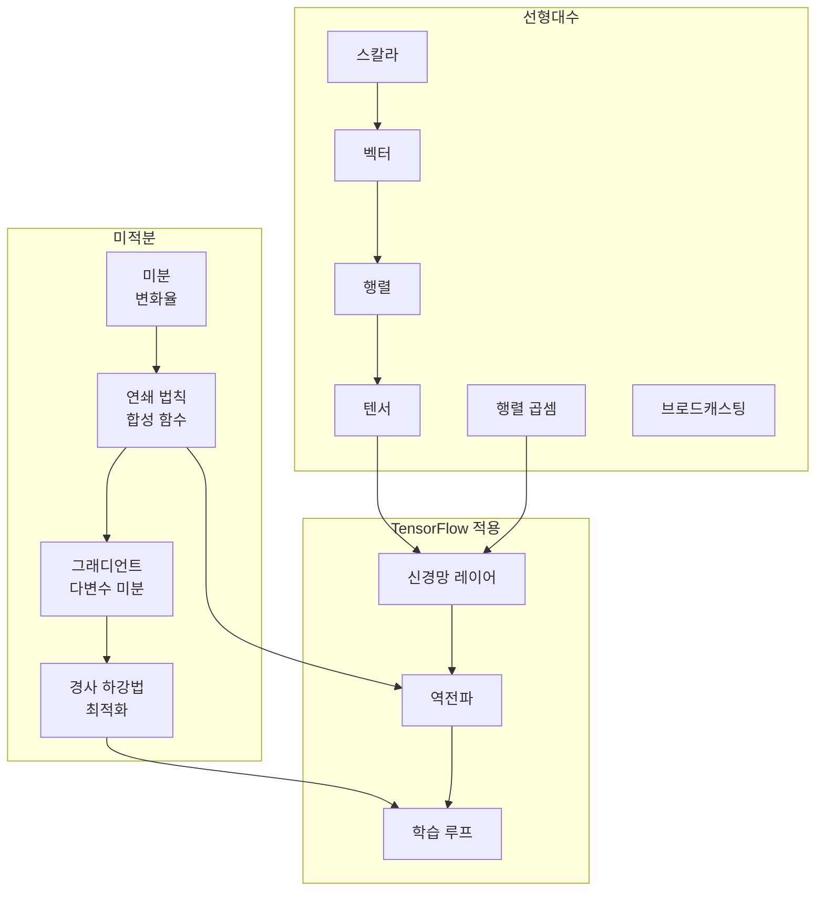

# 수학적 기초

TensorFlow를 이해하기 위한 필수 수학 개념을 **처음부터** 설명합니다. 사전 수학 지식이 없어도 따라갈 수 있습니다.

## 수학 영역 개요

TensorFlow는 세 가지 주요 수학 영역을 사용합니다:

1. **선형대수** - 벡터와 행렬 연산
2. **미적분** - 최적화를 위한 그래디언트 계산
3. **확률** - 불확실성과 분포 처리



---

## 1. 선형대수

### 1.1 스칼라, 벡터, 행렬, 텐서

#### 스칼라 (0차원)

**무엇인가요?**: 하나의 숫자입니다.

**예시**:
- 온도: 72
- 가격: 19,900원
- 나이: 25

```python
import tensorflow as tf

scalar = tf.constant(5.0)  # shape=()
print(f"값: {scalar.numpy()}, shape: {scalar.shape}")
# 값: 5.0, shape: ()
```

---

#### 벡터 (1차원)

**무엇인가요?**: 순서가 있는 숫자들의 목록입니다.

**시각화**:
```
[1, 2, 3, 4, 5]
 ^  ^  ^  ^  ^
 순서가 중요합니다!
```

**실생활 예시**:
- RGB 색상: [255, 128, 0] (빨강, 초록, 파랑)
- 위치: [37.5, 127.0] (위도, 경도)
- 성적: [85, 92, 78, 95]

```python
vector = tf.constant([1.0, 2.0, 3.0])  # shape=(3,)
print(f"값: {vector.numpy()}, shape: {vector.shape}")
# 값: [1. 2. 3.], shape: (3,)
```

---

#### 행렬 (2차원)

**무엇인가요?**: 행과 열로 이루어진 숫자들의 격자입니다.

**시각화**:
```
      col0  col1  col2
row0 [  1,    2,    3 ]
row1 [  4,    5,    6 ]
row2 [  7,    8,    9 ]
```

**실생활 예시**:
- 스프레드시트 데이터
- 흑백 이미지 픽셀: 행 x 열
- 학생-과목 성적표: 학생(행) x 과목(열)

```python
matrix = tf.constant([[1, 2, 3],
                      [4, 5, 6]])  # shape=(2, 3) - 2행 3열
print(f"shape: {matrix.shape}")
# shape: (2, 3)
```

---

#### 텐서 (n차원)

**무엇인가요?**: 임의의 차원 수로 일반화된 것입니다.

**시각화** (3차원 텐서):
```
여러 행렬을 쌓아놓은 것을 상상하세요:
       행렬 0           행렬 1
      [1, 2, 3]       [10, 11, 12]
      [4, 5, 6]       [13, 14, 15]
```

**실생활 예시**:
- 컬러 이미지: 높이 x 너비 x 3 (RGB 채널)
- 비디오: 프레임 x 높이 x 너비 x 3

```python
# 3차원 텐서: 2x2x3 행렬들의 "스택"
tensor_3d = tf.constant([[[1, 2, 3], [4, 5, 6]],
                         [[7, 8, 9], [10, 11, 12]]])
print(f"shape: {tensor_3d.shape}")
# shape: (2, 2, 3)
```

---

### 1.2 행렬 연산

#### 요소별 연산 (Element-wise)

**무엇인가요?**: 각 요소에 독립적으로 연산을 적용합니다.

**시각적 예시 - 덧셈**:
```
[1, 2]   +   [10, 20]   =   [11, 22]
[3, 4]       [30, 40]       [33, 44]
```

**단계별**:
- 위치 (0,0): 1 + 10 = 11
- 위치 (0,1): 2 + 20 = 22
- 위치 (1,0): 3 + 30 = 33
- 위치 (1,1): 4 + 40 = 44

```python
a = tf.constant([[1, 2], [3, 4]])
b = tf.constant([[10, 20], [30, 40]])
result = a + b  # 또는 tf.add(a, b)
print(result.numpy())
# [[11 22]
#  [33 44]]
```

**TensorFlow에서 왜 필요한가요?**: 대부분의 신경망 연산(활성화 함수, 정규화)은 각 요소에 독립적으로 적용됩니다.

---

#### 행렬 곱셈 (Matrix Multiplication)

**무엇인가요?**: 특정 방식으로 행렬들을 결합하여 새 행렬을 만듭니다.

**규칙**: (m x n) @ (n x p) = (m x p)
- 첫 번째 행렬의 열 수가 두 번째 행렬의 행 수와 **반드시** 같아야 합니다

**시각적 단계별**:
```
A (2x3)          B (3x2)          결과 (2x2)
[1, 2, 3]   @   [7, 10]     =    [?, ?]
[4, 5, 6]       [8, 11]          [?, ?]
                [9, 12]
```

**계산**:
- 결과[0,0] = (1×7) + (2×8) + (3×9) = 7 + 16 + 27 = **50**
- 결과[0,1] = (1×10) + (2×11) + (3×12) = 10 + 22 + 36 = **68**
- 결과[1,0] = (4×7) + (5×8) + (6×9) = 28 + 40 + 54 = **122**
- 결과[1,1] = (4×10) + (5×11) + (6×12) = 40 + 55 + 72 = **167**

**결과**:
```
[ 50,  68]
[122, 167]
```

```python
a = tf.constant([[1, 2, 3], [4, 5, 6]], dtype=tf.float32)
b = tf.constant([[7, 10], [8, 11], [9, 12]], dtype=tf.float32)
result = tf.matmul(a, b)  # shape=(2, 2)
print(result.numpy())
# [[ 50.  68.]
#  [122. 167.]]
```

:::tip 왜 중요한가요?
**이것이 신경망의 핵심 연산입니다!**
- 입력 데이터 @ 가중치 = 출력
- 모든 레이어가 행렬 곱셈을 수행합니다
:::

---

#### 브로드캐스팅 (Broadcasting)

**무엇인가요?**: 요소별 연산을 위해 더 작은 텐서를 자동으로 확장합니다.

**시각적 예시**:
```
행렬 (2x3)     +     벡터 (3,)      =     결과 (2x3)
[[1, 2, 3],          [10, 20, 30]         [[11, 22, 33],
 [4, 5, 6]]                                [14, 25, 36]]

벡터가 맞추기 위해 "브로드캐스트" (복사)됩니다:
[[10, 20, 30],
 [10, 20, 30]]
```

**규칙**:
1. shape을 오른쪽에서 왼쪽으로 비교
2. 차원이 일치하거나 둘 중 하나가 1이어야 함
3. 크기 1인 차원이 맞추기 위해 "늘어남"

```python
matrix = tf.constant([[1, 2, 3], [4, 5, 6]])
vector = tf.constant([10, 20, 30])
result = matrix + vector  # 브로드캐스팅이 자동으로 발생
print(result.numpy())
# [[11 22 33]
#  [14 25 36]]
```

**TensorFlow에서 왜 필요한가요?**: 레이어 출력에 편향(bias)을 더할 때 브로드캐스팅이 필요합니다.

---

## 2. 미적분

### 2.1 미분 - 머신러닝의 핵심

#### 미분이란?

**직관적 정의**: 미분은 입력을 조금 변경할 때 출력이 얼마나 변하는지 알려줍니다.

**실생활 비유**:
- 속도는 시간에 대한 위치의 미분입니다
- "1시간 더 기다리면, 자동차가 얼마나 더 멀리 갔을까요?"

**시각화**:
```
함수: y = x²

       y
       |      *
       |    *
       |  *          <- 여기서 기울기 = 미분 = 6
       |*            <- x=3에서, 기울기가 더 가파름
      *|
    *  |
   *   +--------x
          x=3

x=3일 때: y = 9
x=3에서 미분: 2×3 = 6
의미: "x가 1 증가하면, y는 약 6 증가한다"
```

---

#### 단계별 미분 계산

**함수**: y = x²

**질문**: x = 3에서 dy/dx는?

**방법 1: 정의 (개념적)**
```
dy/dx = limit(h→0) [f(x+h) - f(x)] / h

x=3에서:
= limit [f(3+h) - f(3)] / h
= limit [(3+h)² - 9] / h
= limit [9 + 6h + h² - 9] / h
= limit [6h + h²] / h
= limit [6 + h]
= 6  (h가 0에 접근할 때)
```

**방법 2: 거듭제곱 법칙**
```
y = xⁿ 이면, dy/dx = n × x^(n-1)

y = x²
dy/dx = 2 × x^(2-1) = 2x

x=3일 때: dy/dx = 2×3 = 6
```

**TensorFlow에서 왜 필요한가요?**: 학습 중 모든 가중치 업데이트가 미분을 사용합니다!

```python
x = tf.Variable(3.0)

with tf.GradientTape() as tape:
    y = x ** 2  # y = x²

dy_dx = tape.gradient(y, x)
print(f"x=3에서 dy/dx = {dy_dx.numpy()}")
# x=3에서 dy/dx = 6.0
```

---

### 2.2 연쇄 법칙 - 딥러닝의 열쇠

#### 연쇄 법칙이란?

**정의**: 함수들이 합성(중첩)되어 있을 때, 전체 미분은 개별 미분들의 곱입니다.

**공식**: y = f(g(x))이면, dy/dx = (dy/dg) × (dg/dx)

**실생활 비유**:
- 시간당 20,000원을 받습니다 (dMoney/dHours = 20,000)
- 시간당 3km를 걸을 수 있습니다 (dKm/dHours = 3)
- km당 얼마를 버나요?
- dMoney/dKm = dMoney/dHours ÷ dKm/dHours = 20,000/3 원/km

---

#### 단계별 연쇄 법칙 예시

**함수**: y = (2x + 3)²

**단계 1**: 합성 함수 파악
- 외부 함수: u² (여기서 u = 2x + 3)
- 내부 함수: u = 2x + 3

**단계 2**: 개별 미분 계산
- dy/du = 2u (u²의 미분)
- du/dx = 2 (2x + 3의 미분)

**단계 3**: 연쇄 법칙 적용
- dy/dx = (dy/du) × (du/dx)
- dy/dx = 2u × 2
- dy/dx = 2(2x + 3) × 2
- dy/dx = 4(2x + 3)

**x = 2일 때**:
- dy/dx = 4(2×2 + 3) = 4(7) = 28

**TensorFlow에서 왜 필요한가요?**: 딥 네트워크는 많은 함수들의 합성입니다. 연쇄 법칙으로 모든 레이어를 통해 그래디언트를 계산할 수 있습니다!

```python
x = tf.Variable(2.0)

with tf.GradientTape() as tape:
    y = (2 * x + 3) ** 2  # y = (2x + 3)²

dy_dx = tape.gradient(y, x)
print(f"x=2에서 dy/dx = {dy_dx.numpy()}")
# x=2에서 dy/dx = 28.0
```

---

### 2.3 그래디언트 - 다변수 미분

#### 그래디언트란?

**정의**: 그래디언트는 모든 편미분의 벡터입니다. 가장 가파른 상승 방향을 가리킵니다.

**함수 f(x, y)에 대해**:
- 그래디언트 = [∂f/∂x, ∂f/∂y]

**실생활 비유**: 언덕 위에 서 있다고 상상하세요.
- 그래디언트는 가장 가파른 오르막 방향을 알려줍니다
- 크기는 얼마나 가파른지 알려줍니다
- 빠르게 내려가려면: 그래디언트의 **반대** 방향으로 가세요 (경사 하강법!)

---

#### 단계별 그래디언트 계산

**함수**: f(x, y) = x² + 2xy + y²

**단계 1**: x에 대한 편미분 (y는 상수로 취급)
```
∂f/∂x = 2x + 2y
```

**단계 2**: y에 대한 편미분 (x는 상수로 취급)
```
∂f/∂y = 2x + 2y
```

**단계 3**: 그래디언트 벡터 형성
```
gradient = [2x + 2y, 2x + 2y]
```

**점 (1, 2)에서**:
```
gradient = [2(1) + 2(2), 2(1) + 2(2)]
         = [6, 6]
```

**해석**: (1, 2)에서 가장 가파른 오르막 방향은 [6, 6] (대각선)입니다.

```python
x = tf.Variable(1.0)
y = tf.Variable(2.0)

with tf.GradientTape() as tape:
    f = x**2 + 2*x*y + y**2

gradients = tape.gradient(f, [x, y])
print(f"∂f/∂x = {gradients[0].numpy()}")  # 6.0
print(f"∂f/∂y = {gradients[1].numpy()}")  # 6.0
```

---

### 2.4 경사 하강법 - 신경망 학습 방법

#### 시각적 설명

```
     손실
       |
       |   *
       |    \
       |     \  <- 그래디언트를 따라 내려감
       |      \
       |       \
       |        *  <- 최솟값 (목표!)
       |
       +-------------------> 가중치

그래디언트는 위쪽(가장 가파른 상승)을 가리킵니다
우리는 반대 방향(가장 가파른 하강)으로 갑니다
```

#### 알고리즘 단계별

**목표**: 손실 함수 L(w)를 최소화 (w = 가중치)

1. **초기화**: 랜덤 가중치 w로 시작
2. **순전파**: 손실 L(w) 계산
3. **역전파**: 그래디언트 dL/dw 계산
4. **업데이트**: w_new = w_old - learning_rate × gradient
5. 수렴할 때까지 **반복**

#### 실습 예제

```
손실 함수: L(w) = w² (이것을 최소화하고 싶음)
학습률: 0.1
초기 가중치: w = 5

반복 1:
- 그래디언트: dL/dw = 2w = 2×5 = 10
- 업데이트: w = 5 - 0.1×10 = 5 - 1 = 4
- 손실: L = 4² = 16

반복 2:
- 그래디언트: dL/dw = 2×4 = 8
- 업데이트: w = 4 - 0.1×8 = 4 - 0.8 = 3.2
- 손실: L = 3.2² = 10.24

... w가 0(최솟값)에 접근할 때까지 계속
```

```python
x = tf.Variable(5.0)
optimizer = tf.optimizers.SGD(learning_rate=0.1)

for i in range(10):
    with tf.GradientTape() as tape:
        loss = x ** 2
    gradients = tape.gradient(loss, [x])
    optimizer.apply_gradients(zip(gradients, [x]))
    print(f"반복 {i+1}: x = {x.numpy():.4f}, 손실 = {(x**2).numpy():.4f}")
```

출력:
```
반복 1: x = 4.0000, 손실 = 16.0000
반복 2: x = 3.2000, 손실 = 10.2400
반복 3: x = 2.5600, 손실 = 6.5536
반복 4: x = 2.0480, 손실 = 4.1943
반복 5: x = 1.6384, 손실 = 2.6844
...
반복 10: x = 0.5369, 손실 = 0.2882
```

---

## 3. 확률 (간략 개요)

### TensorFlow에서 왜 확률이 필요한가요?

1. **불확실성**: 모델은 불확실한 예측을 다룹니다
2. **손실 함수**: 교차 엔트로피 손실은 확률을 사용합니다
3. **정규화**: 드롭아웃은 뉴런을 무작위로 "드롭"합니다
4. **초기화**: 가중치는 분포에서 초기화됩니다

### 주요 개념

#### 확률 분포

**무엇인가요?**: 다양한 결과의 가능성을 설명하는 함수입니다.

**예시 - 정규 분포**:
```
           *
          * *
         *   *
        *     *      <- 대부분의 값이 중심 근처
       *       *
      *         *
     *           *
-3  -2  -1   0   1   2   3   (평균에서의 표준편차)
```

```python
# 정규 분포에서 무작위 값
random_values = tf.random.normal(shape=[1000], mean=0, stddev=1)
print(f"평균: {tf.reduce_mean(random_values).numpy():.4f}")
print(f"표준편차: {tf.math.reduce_std(random_values).numpy():.4f}")
```

---

## 연습 문제

### 연습 1: 행렬 곱셈
행렬 곱을 손으로 계산하고 TensorFlow로 검증하세요:
```python
# A = [[1, 2], [3, 4]]
# B = [[5, 6], [7, 8]]
# 1. A @ B를 손으로 계산
# 2. tf.matmul로 검증
# 3. [[1,2,3]] @ [[4,5,6]]은 어떻게 될까요? 왜?
```

### 연습 2: 그래디언트 계산
GradientTape를 사용하여 그래디언트를 계산하세요:
```python
# 함수: y = x³ + 2x² - x + 5
# 1. dy/dx는 무엇인가요?
# 2. x = 2에서 분석적으로, TensorFlow로 계산
# 3. GradientTape로 검증
```

### 연습 3: 경사 하강법 구현
간단한 경사 하강법을 구현하세요:
```python
# 과제: x² + y²가 최소화되는 x, y 찾기
# 1. x = tf.Variable(10.0), y = tf.Variable(10.0) 초기화
# 2. GradientTape로 x² + y²의 그래디언트 계산
# 3. 수동으로 업데이트: x = x - 0.1 * gradient_x
# 4. x, y가 0에 가까워질 때까지 반복
```

### 연습 4: 연쇄 법칙 이해
연쇄 법칙이 어떻게 작동하는지 확인하세요:
```python
# 함수: y = sin(x²)
# 1. dy/dx를 연쇄 법칙으로 유도
# 2. x = π/4에서 손으로 계산
# 3. TensorFlow로 검증
```
