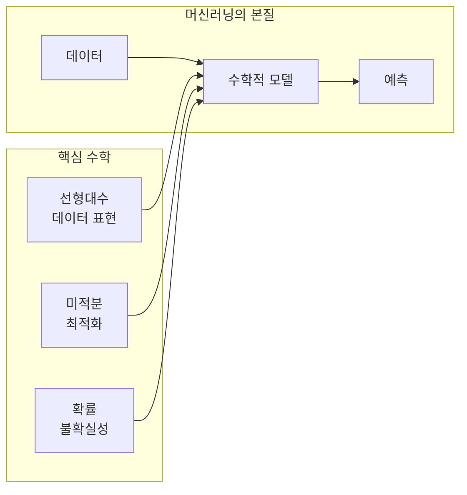
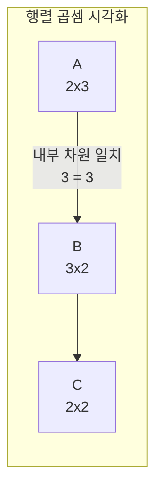
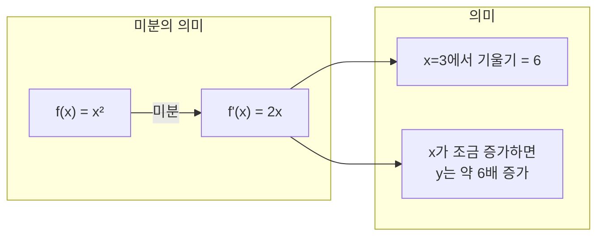
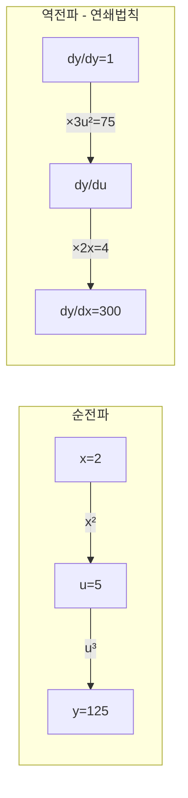
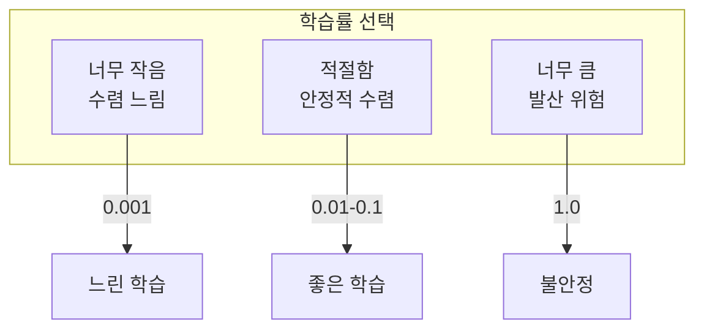

# 수학적 기초

TensorFlow를 깊이 이해하기 위해 필요한 수학 개념들을 **처음부터** 설명합니다. 사전 지식이 없어도 따라갈 수 있습니다.

## 왜 수학이 필요한가?



## 선형대수 기초

### 스칼라, 벡터, 행렬, 텐서

**스칼라 (Scalar)**: 단일 숫자

```python
import tensorflow as tf

# 스칼라: 차원이 없는 단일 값
temperature = tf.constant(36.5)
print(temperature.shape)  # ()
```

**벡터 (Vector)**: 숫자의 1차원 배열

```python
# 벡터: 1차원 배열
# 예: RGB 색상 = [Red, Green, Blue]
color = tf.constant([255, 128, 0])  # 주황색
print(color.shape)  # (3,)

# 예: 학생의 시험 점수
scores = tf.constant([85.0, 92.0, 78.0, 95.0])
print(scores.shape)  # (4,)
```

**행렬 (Matrix)**: 숫자의 2차원 배열

```python
# 행렬: 2차원 배열
# 예: 3명의 학생, 4개 과목 점수
grades = tf.constant([
    [85, 92, 78, 95],  # 학생 1
    [90, 88, 85, 92],  # 학생 2
    [75, 80, 82, 88]   # 학생 3
])
print(grades.shape)  # (3, 4) - 3행 4열
```

**텐서 (Tensor)**: n차원 배열

```python
# 3차원 텐서
# 예: 컬러 이미지 = [높이, 너비, 채널(RGB)]
image = tf.random.uniform([224, 224, 3])
print(image.shape)  # (224, 224, 3)

# 4차원 텐서
# 예: 배치 이미지 = [배치, 높이, 너비, 채널]
batch_images = tf.random.uniform([32, 224, 224, 3])
print(batch_images.shape)  # (32, 224, 224, 3)
```

---

### 행렬 연산

**행렬 덧셈**: 같은 위치의 요소끼리 더함

```python
A = tf.constant([[1, 2], [3, 4]])
B = tf.constant([[5, 6], [7, 8]])

C = A + B  # [[6, 8], [10, 12]]
```

**행렬 곱셈**: 가장 중요한 연산

```python
# 행렬 곱셈: A(m×n) × B(n×p) = C(m×p)
A = tf.constant([[1, 2, 3],   # 2×3 행렬
                 [4, 5, 6]])

B = tf.constant([[7, 8],      # 3×2 행렬
                 [9, 10],
                 [11, 12]])

C = tf.matmul(A, B)  # 2×2 행렬
# [[58, 64], [139, 154]]
```



**왜 행렬 곱셈이 중요한가?**

신경망의 핵심 연산이 행렬 곱셈입니다:

```python
# 신경망 레이어: y = Wx + b
# 입력: 100개 샘플, 784 특성 (28×28 이미지)
x = tf.random.normal([100, 784])

# 가중치: 784 입력 → 128 출력
W = tf.Variable(tf.random.normal([784, 128]))
b = tf.Variable(tf.zeros([128]))

# 순전파: 행렬 곱셈!
y = tf.matmul(x, W) + b  # 결과: (100, 128)
```

---

### 전치 (Transpose)

행과 열을 바꾸는 연산입니다.

```python
A = tf.constant([[1, 2, 3],
                 [4, 5, 6]])  # 2×3

A_T = tf.transpose(A)
# [[1, 4],
#  [2, 5],
#  [3, 6]]  # 3×2
```

---

## 미적분 기초

### 미분의 직관적 이해

**미분 = 변화율 = 기울기**



```python
import tensorflow as tf

x = tf.Variable(3.0)

with tf.GradientTape() as tape:
    y = x ** 2  # y = x²

dy_dx = tape.gradient(y, x)
print(dy_dx.numpy())  # 6.0 (= 2 * 3)
```

---

### 편미분 (Partial Derivative)

여러 변수가 있을 때, 하나만 변화시키고 나머지는 고정

```python
# z = x² + xy + y²
x = tf.Variable(2.0)
y = tf.Variable(3.0)

with tf.GradientTape() as tape:
    z = x**2 + x*y + y**2  # z = 4 + 6 + 9 = 19

# ∂z/∂x = 2x + y = 4 + 3 = 7
# ∂z/∂y = x + 2y = 2 + 6 = 8
gradients = tape.gradient(z, [x, y])
print([g.numpy() for g in gradients])  # [7.0, 8.0]
```

---

### 그래디언트 (Gradient)

모든 편미분을 모은 벡터

```python
# 손실 함수: L(w1, w2, w3) = w1² + 2w2² + 3w3²
weights = tf.Variable([1.0, 2.0, 3.0])

with tf.GradientTape() as tape:
    loss = weights[0]**2 + 2*weights[1]**2 + 3*weights[2]**2

# 그래디언트: [∂L/∂w1, ∂L/∂w2, ∂L/∂w3]
#           = [2w1, 4w2, 6w3]
#           = [2, 8, 18]
grad = tape.gradient(loss, weights)
print(grad.numpy())  # [2., 8., 18.]
```

---

### 연쇄 법칙 (Chain Rule)

합성 함수의 미분: **바깥 미분 × 안쪽 미분**

```python
# y = (x² + 1)³
# dy/dx = 3(x² + 1)² · 2x

x = tf.Variable(2.0)

with tf.GradientTape() as tape:
    inner = x**2 + 1   # u = x² + 1 = 5
    y = inner ** 3     # y = u³ = 125

dy_dx = tape.gradient(y, x)
# = 3 * (5)² * 2 * 2 = 3 * 25 * 4 = 300
print(dy_dx.numpy())  # 300.0
```

**TensorFlow의 자동 미분**은 연쇄 법칙을 자동으로 적용합니다!



---

## 경사 하강법 (Gradient Descent)

### 직관적 이해

산에서 가장 낮은 곳(최솟값)을 찾아가는 방법:
1. 현재 위치에서 **가장 가파른 내리막 방향** 확인 (그래디언트의 반대)
2. 그 방향으로 **한 걸음** 이동 (학습률만큼)
3. 반복

```python
# 손실 함수: L(w) = (w - 5)²
# 최솟값: w = 5

w = tf.Variable(0.0)  # 시작점
learning_rate = 0.1

for step in range(20):
    with tf.GradientTape() as tape:
        loss = (w - 5) ** 2

    grad = tape.gradient(loss, w)  # dL/dw = 2(w - 5)
    w.assign_sub(learning_rate * grad)  # w = w - lr * grad

    if step % 5 == 0:
        print(f"Step {step}: w = {w.numpy():.4f}, loss = {loss.numpy():.4f}")
```

출력:
```
Step 0: w = 1.0000, loss = 25.0000
Step 5: w = 4.0951, loss = 0.8186
Step 10: w = 4.9028, loss = 0.0094
Step 15: w = 4.9901, loss = 0.0001
```

---

### 학습률의 중요성



---

## 핵심 공식 정리

| 개념 | 공식 | TensorFlow |
|------|------|------------|
| 행렬 곱셈 | C = AB | `tf.matmul(A, B)` |
| 전치 | Aᵀ | `tf.transpose(A)` |
| 미분 | dy/dx | `tape.gradient(y, x)` |
| 그래디언트 | ∇L | `tape.gradient(loss, vars)` |
| 경사 하강 | w = w - α∇L | `w.assign_sub(lr * grad)` |

---

## 연습 문제

### 연습 1: 행렬 연산
```python
# 다음 행렬들로 연산을 수행하세요
A = tf.constant([[1, 2], [3, 4]], dtype=tf.float32)
B = tf.constant([[5, 6], [7, 8]], dtype=tf.float32)

# TODO:
# 1. A + B 계산
# 2. A × B (행렬 곱셈) 계산
# 3. A의 전치 계산
# 4. Aᵀ × B 계산
```

### 연습 2: 그래디언트 계산
```python
# 함수: f(x, y) = x²y + y³
# 1. x=2, y=3에서 ∂f/∂x와 ∂f/∂y를 손으로 계산하세요
# 2. GradientTape로 검증하세요

# 힌트:
# ∂f/∂x = 2xy
# ∂f/∂y = x² + 3y²
```

### 연습 3: 경사 하강법 구현
```python
# 손실 함수: L(w) = w⁴ - 4w³ + 4w²
# 이 함수의 최솟값을 경사 하강법으로 찾으세요
# 힌트: 시작점에 따라 다른 최솟값에 도달할 수 있습니다
```
