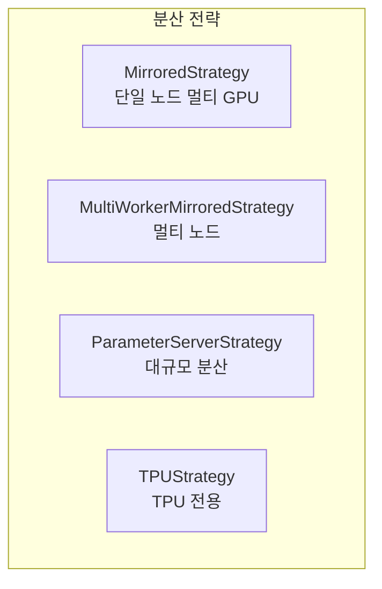
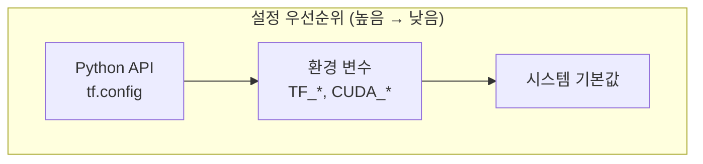

# 환경 설정

TensorFlow의 동작을 제어하는 환경 변수와 설정 옵션을 설명합니다.

## 환경 변수

### GPU 관련

| 환경 변수 | 설명 | 예시 |
|-----------|------|------|
| `CUDA_VISIBLE_DEVICES` | 사용할 GPU 지정 | `0,1` (GPU 0, 1만 사용) |
| `TF_FORCE_GPU_ALLOW_GROWTH` | GPU 메모리 증가 허용 | `true` |
| `TF_GPU_ALLOCATOR` | GPU 메모리 할당기 | `cuda_malloc_async` |
| `TF_GPU_THREAD_MODE` | GPU 스레드 모드 | `gpu_private` |

```bash
# 특정 GPU만 사용
export CUDA_VISIBLE_DEVICES=0,1

# GPU 메모리 동적 할당
export TF_FORCE_GPU_ALLOW_GROWTH=true
```

### 로깅 관련

| 환경 변수 | 설명 | 값 |
|-----------|------|-----|
| `TF_CPP_MIN_LOG_LEVEL` | C++ 로그 레벨 | 0(모두), 1(INFO 제외), 2(WARNING 제외), 3(ERROR만) |
| `TF_ENABLE_ONEDNN_OPTS` | oneDNN 최적화 | `0` (비활성화), `1` (활성화) |

```bash
# 경고 메시지 숨기기
export TF_CPP_MIN_LOG_LEVEL=2

# oneDNN 최적화 메시지 숨기기
export TF_ENABLE_ONEDNN_OPTS=0
```

### XLA 관련

| 환경 변수 | 설명 | 예시 |
|-----------|------|------|
| `XLA_FLAGS` | XLA 컴파일러 플래그 | `--xla_gpu_cuda_data_dir=/usr/local/cuda` |
| `TF_XLA_FLAGS` | TF-XLA 통합 플래그 | `--tf_xla_auto_jit=2` |

```bash
# XLA 자동 클러스터링 활성화
export TF_XLA_FLAGS="--tf_xla_auto_jit=2"
```

---

## Python 설정 API

### GPU 설정

```python
import tensorflow as tf

# 사용 가능한 GPU 확인
gpus = tf.config.list_physical_devices('GPU')
print(f"GPU 개수: {len(gpus)}")

# GPU 메모리 증가 허용
if gpus:
    for gpu in gpus:
        tf.config.experimental.set_memory_growth(gpu, True)

# 메모리 제한 설정 (4GB로 제한)
if gpus:
    tf.config.set_logical_device_configuration(
        gpus[0],
        [tf.config.LogicalDeviceConfiguration(memory_limit=4096)]
    )

# 특정 GPU만 보이게 설정
if len(gpus) > 1:
    tf.config.set_visible_devices(gpus[0], 'GPU')
```

### 가상 GPU 생성

```python
# 하나의 물리 GPU를 여러 논리 GPU로 분할
gpus = tf.config.list_physical_devices('GPU')
if gpus:
    tf.config.set_logical_device_configuration(
        gpus[0],
        [
            tf.config.LogicalDeviceConfiguration(memory_limit=2048),
            tf.config.LogicalDeviceConfiguration(memory_limit=2048)
        ]
    )

logical_gpus = tf.config.list_logical_devices('GPU')
print(f"논리 GPU 개수: {len(logical_gpus)}")
```

---

### 실행 모드 설정

```python
import tensorflow as tf

# Eager execution 상태 확인
print(tf.executing_eagerly())  # True (기본값)

# tf.function을 eager 모드로 실행 (디버깅용)
tf.config.run_functions_eagerly(True)

# 다시 그래프 모드로 전환
tf.config.run_functions_eagerly(False)
```

---

### 디바이스 배치 로깅

```python
import tensorflow as tf

# 연산이 어느 디바이스에서 실행되는지 로그
tf.debugging.set_log_device_placement(True)

# 테스트
a = tf.constant([1.0, 2.0])
b = tf.constant([3.0, 4.0])
c = a + b  # 로그에 디바이스 정보 출력
```

---

## 성능 관련 설정

### 스레드 설정

```python
import tensorflow as tf

# inter-op 병렬성 (연산 간 병렬)
tf.config.threading.set_inter_op_parallelism_threads(4)

# intra-op 병렬성 (연산 내 병렬)
tf.config.threading.set_intra_op_parallelism_threads(4)

# 현재 설정 확인
print(tf.config.threading.get_inter_op_parallelism_threads())
print(tf.config.threading.get_intra_op_parallelism_threads())
```

### Mixed Precision

```python
import tensorflow as tf

# Mixed Precision 정책 설정
tf.keras.mixed_precision.set_global_policy('mixed_float16')

# 현재 정책 확인
print(tf.keras.mixed_precision.global_policy())

# 기본값으로 복원
tf.keras.mixed_precision.set_global_policy('float32')
```

---

## 분산 학습 설정



### MirroredStrategy

```python
import tensorflow as tf

# 모든 GPU 사용
strategy = tf.distribute.MirroredStrategy()

# 특정 GPU만 사용
strategy = tf.distribute.MirroredStrategy(devices=["/gpu:0", "/gpu:1"])

print(f"사용 중인 디바이스 수: {strategy.num_replicas_in_sync}")

# 전략 범위 내에서 모델 생성
with strategy.scope():
    model = tf.keras.Sequential([
        tf.keras.layers.Dense(128, activation='relu'),
        tf.keras.layers.Dense(10)
    ])
    model.compile(optimizer='adam', loss='sparse_categorical_crossentropy')
```

### MultiWorkerMirroredStrategy

```python
import json
import os
import tensorflow as tf

# 클러스터 설정 (환경 변수로)
os.environ['TF_CONFIG'] = json.dumps({
    'cluster': {
        'worker': ['worker0:2222', 'worker1:2222']
    },
    'task': {'type': 'worker', 'index': 0}
})

strategy = tf.distribute.MultiWorkerMirroredStrategy()

with strategy.scope():
    model = create_model()
    model.compile(...)
```

---

## Keras 설정

### 백엔드 설정

```python
import os

# Keras 백엔드 설정 (TensorFlow 2.x에서는 기본값)
os.environ['KERAS_BACKEND'] = 'tensorflow'
```

### 전역 설정

```python
import tensorflow as tf

# 이미지 데이터 형식
tf.keras.backend.set_image_data_format('channels_last')  # NHWC
# 또는
tf.keras.backend.set_image_data_format('channels_first')  # NCHW

# 부동소수점 정밀도
tf.keras.backend.set_floatx('float32')

# epsilon 값 (수치 안정성)
tf.keras.backend.set_epsilon(1e-7)
```

---

## 자주 사용하는 설정 조합

### 개발/디버깅 환경

```python
import tensorflow as tf
import os

# 로그 레벨 설정
os.environ['TF_CPP_MIN_LOG_LEVEL'] = '0'  # 모든 로그 표시

# Eager 모드 강제
tf.config.run_functions_eagerly(True)

# 디바이스 배치 로그
tf.debugging.set_log_device_placement(True)

# GPU 메모리 증가 허용
gpus = tf.config.list_physical_devices('GPU')
for gpu in gpus:
    tf.config.experimental.set_memory_growth(gpu, True)
```

### 프로덕션 환경

```python
import tensorflow as tf
import os

# 불필요한 로그 숨기기
os.environ['TF_CPP_MIN_LOG_LEVEL'] = '2'
os.environ['TF_ENABLE_ONEDNN_OPTS'] = '0'

# 그래프 모드 사용
tf.config.run_functions_eagerly(False)

# Mixed Precision 활성화
tf.keras.mixed_precision.set_global_policy('mixed_float16')

# XLA 컴파일 활성화
os.environ['TF_XLA_FLAGS'] = '--tf_xla_auto_jit=2'
```

### 메모리 제한 환경

```python
import tensorflow as tf

# GPU 메모리 제한
gpus = tf.config.list_physical_devices('GPU')
if gpus:
    tf.config.set_logical_device_configuration(
        gpus[0],
        [tf.config.LogicalDeviceConfiguration(memory_limit=2048)]  # 2GB
    )

# 또는 CPU만 사용
tf.config.set_visible_devices([], 'GPU')
```

---

## 설정 우선순위



**참고**: Python API 설정은 환경 변수보다 우선합니다. 프로그램 시작 시 가능한 빨리 설정해야 합니다.

---

## 문제 해결

### GPU 인식 안 됨

```python
# CUDA 설치 확인
import tensorflow as tf
print(tf.test.is_built_with_cuda())  # True여야 함
print(tf.config.list_physical_devices('GPU'))

# 드라이버 버전 확인 (터미널)
# nvidia-smi
```

### 메모리 부족 (OOM)

```python
# 배치 크기 줄이기
# 메모리 증가 허용
gpus = tf.config.list_physical_devices('GPU')
for gpu in gpus:
    tf.config.experimental.set_memory_growth(gpu, True)

# 또는 메모리 제한
tf.config.set_logical_device_configuration(
    gpus[0],
    [tf.config.LogicalDeviceConfiguration(memory_limit=4096)]
)
```

### 느린 학습 속도

```python
# 데이터 파이프라인 최적화
dataset = dataset.prefetch(tf.data.AUTOTUNE)

# Mixed Precision 활성화
tf.keras.mixed_precision.set_global_policy('mixed_float16')

# XLA 컴파일 활성화
@tf.function(jit_compile=True)
def train_step(...):
    ...
```
