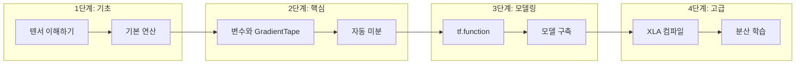

# TensorFlow 학습 가이드

TensorFlow는 Google이 개발한 오픈소스 머신러닝 플랫폼입니다. 이 문서는 TensorFlow의 핵심 개념부터 내부 아키텍처까지 깊이 있게 이해할 수 있도록 설계되었습니다.

## 이 가이드의 특징

이 문서는 단순한 API 레퍼런스가 아닌 **학습 중심의 가이드**입니다:

- **왜(Why)?** - 모든 설계 결정의 이유를 설명합니다
- **개념 먼저** - 코드보다 개념적 이해를 우선합니다
- **단순에서 복잡으로** - 기초부터 고급까지 단계별로 진행합니다
- **실습 포함** - 이해도를 확인할 수 있는 연습문제를 제공합니다

## 학습 순서



## 빠른 시작

### 설치

```bash
# GPU 지원 TensorFlow 설치
pip install tensorflow

# CPU 전용 (더 가벼움)
pip install tensorflow-cpu
```

### 첫 번째 코드

```python
import tensorflow as tf

# 텐서 생성
hello = tf.constant('안녕하세요, TensorFlow!')
print(hello.numpy())  # b'안녕하세요, TensorFlow!'

# 간단한 연산
result = tf.add(1, 2)
print(result.numpy())  # 3
```

## 문서 구성

| 섹션 | 내용 | 대상 |
|------|------|------|
| [개념 이해](/docs/concepts/glossary) | 핵심 용어와 개념 설명 | 모든 수준 |
| [수학적 기초](/docs/concepts/math-foundations) | 필수 수학 개념 | 초급 |
| [아키텍처](/docs/architecture/overview) | 내부 구조와 설계 | 중급 이상 |
| [API 레퍼런스](/docs/api/python-api) | 주요 API 문서 | 모든 수준 |
| [사용 가이드](/docs/usage/getting-started) | 실전 사용 패턴 | 초급~중급 |
| [코드 분석](/docs/code-walkthrough/reading-order) | 소스 코드 해설 | 고급 |

## 전제 조건

이 가이드를 효과적으로 활용하기 위해 필요한 사전 지식:

### 필수
- Python 기초 (변수, 함수, 클래스)
- 기본적인 프로그래밍 개념

### 권장
- NumPy 배열 기초
- 선형대수 기초 (벡터, 행렬)
- 미적분 기초 (미분 개념)

:::tip 수학이 어렵다면?
[수학적 기초](/docs/concepts/math-foundations) 섹션에서 필요한 모든 수학 개념을 **처음부터** 설명합니다. 사전 수학 지식이 없어도 따라갈 수 있습니다!
:::

## 다음 단계

학습 목표에 따라 시작점을 선택하세요:

- **TensorFlow가 처음이라면** → [개념 용어집](/docs/concepts/glossary)부터 시작
- **빠르게 사용하고 싶다면** → [시작 가이드](/docs/usage/getting-started)로 이동
- **내부 구조가 궁금하다면** → [아키텍처 개요](/docs/architecture/overview) 확인
- **소스 코드를 읽고 싶다면** → [코드 읽기 순서](/docs/code-walkthrough/reading-order) 참고
