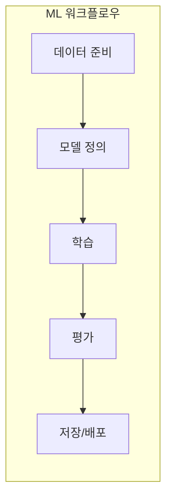
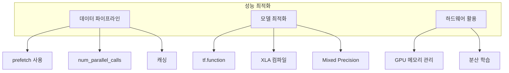

# 시작 가이드

TensorFlow를 실제로 사용하는 방법을 단계별로 안내합니다.

## 설치

### 기본 설치

```bash
# GPU 지원 TensorFlow (권장)
pip install tensorflow

# CPU 전용 (가벼운 버전)
pip install tensorflow-cpu

# 특정 버전 설치
pip install tensorflow==2.15.0
```

### 설치 확인

```python
import tensorflow as tf

print(tf.__version__)  # 버전 확인
print(tf.config.list_physical_devices())  # 사용 가능한 디바이스

# GPU 확인
gpus = tf.config.list_physical_devices('GPU')
print(f"사용 가능한 GPU: {len(gpus)}개")
```

---

## 첫 번째 프로그램

### 텐서 다루기

```python
import tensorflow as tf

# 상수 텐서 생성
a = tf.constant([1, 2, 3])
b = tf.constant([4, 5, 6])

# 기본 연산
print(a + b)      # [5, 7, 9]
print(a * b)      # [4, 10, 18]
print(tf.reduce_sum(a))  # 6

# NumPy 변환
import numpy as np
numpy_array = a.numpy()
tensor_from_numpy = tf.constant(np.array([1, 2, 3]))
```

---

## 기본 워크플로우



---

## 데이터 파이프라인

### tf.data.Dataset 사용

```python
import tensorflow as tf

# 데이터 생성
x_train = tf.random.normal([1000, 10])
y_train = tf.random.uniform([1000], 0, 2, dtype=tf.int32)

# Dataset 생성
dataset = tf.data.Dataset.from_tensor_slices((x_train, y_train))

# 전처리 파이프라인
dataset = (dataset
    .shuffle(buffer_size=1000)  # 셔플
    .batch(32)                   # 배치
    .prefetch(tf.data.AUTOTUNE)) # 프리페치

# 데이터 확인
for x, y in dataset.take(1):
    print(f"입력 shape: {x.shape}")   # (32, 10)
    print(f"레이블 shape: {y.shape}") # (32,)
```

### 이미지 데이터 로드

```python
import tensorflow as tf

# 디렉토리에서 이미지 로드
train_ds = tf.keras.utils.image_dataset_from_directory(
    'data/train',
    image_size=(224, 224),
    batch_size=32,
    label_mode='categorical'
)

# 데이터 증강
data_augmentation = tf.keras.Sequential([
    tf.keras.layers.RandomFlip("horizontal"),
    tf.keras.layers.RandomRotation(0.1),
    tf.keras.layers.RandomZoom(0.1),
])

# 전처리 파이프라인
train_ds = train_ds.map(
    lambda x, y: (data_augmentation(x, training=True), y),
    num_parallel_calls=tf.data.AUTOTUNE
).prefetch(tf.data.AUTOTUNE)
```

---

## 모델 구축

### Sequential API (간단한 모델)

```python
import tensorflow as tf

model = tf.keras.Sequential([
    tf.keras.layers.Input(shape=(784,)),
    tf.keras.layers.Dense(256, activation='relu'),
    tf.keras.layers.Dropout(0.2),
    tf.keras.layers.Dense(128, activation='relu'),
    tf.keras.layers.Dropout(0.2),
    tf.keras.layers.Dense(10, activation='softmax')
])

model.summary()
```

### Functional API (복잡한 모델)

```python
import tensorflow as tf

# 다중 입력 모델
input_a = tf.keras.Input(shape=(32,), name='input_a')
input_b = tf.keras.Input(shape=(64,), name='input_b')

# 각 입력 처리
x_a = tf.keras.layers.Dense(16, activation='relu')(input_a)
x_b = tf.keras.layers.Dense(16, activation='relu')(input_b)

# 결합
combined = tf.keras.layers.concatenate([x_a, x_b])
output = tf.keras.layers.Dense(1, activation='sigmoid')(combined)

model = tf.keras.Model(inputs=[input_a, input_b], outputs=output)
```

### Subclassing (완전 커스텀)

```python
import tensorflow as tf

class CustomModel(tf.keras.Model):
    def __init__(self):
        super().__init__()
        self.dense1 = tf.keras.layers.Dense(128, activation='relu')
        self.dense2 = tf.keras.layers.Dense(64, activation='relu')
        self.dense3 = tf.keras.layers.Dense(10)

    def call(self, inputs, training=False):
        x = self.dense1(inputs)
        if training:
            x = tf.nn.dropout(x, rate=0.2)
        x = self.dense2(x)
        return self.dense3(x)

model = CustomModel()
```

---

## 학습

### 기본 학습

```python
import tensorflow as tf

# 모델 컴파일
model.compile(
    optimizer=tf.keras.optimizers.Adam(learning_rate=0.001),
    loss='sparse_categorical_crossentropy',
    metrics=['accuracy']
)

# 학습
history = model.fit(
    train_dataset,
    epochs=10,
    validation_data=val_dataset,
    callbacks=[
        tf.keras.callbacks.EarlyStopping(patience=3),
        tf.keras.callbacks.ModelCheckpoint('best_model.keras')
    ]
)
```

### 커스텀 학습 루프

```python
import tensorflow as tf

model = CustomModel()
optimizer = tf.keras.optimizers.Adam()
loss_fn = tf.keras.losses.SparseCategoricalCrossentropy(from_logits=True)

@tf.function
def train_step(x, y):
    with tf.GradientTape() as tape:
        predictions = model(x, training=True)
        loss = loss_fn(y, predictions)

    gradients = tape.gradient(loss, model.trainable_variables)
    optimizer.apply_gradients(zip(gradients, model.trainable_variables))
    return loss

# 학습 루프
for epoch in range(10):
    total_loss = 0.0
    for x_batch, y_batch in train_dataset:
        loss = train_step(x_batch, y_batch)
        total_loss += loss

    print(f"Epoch {epoch + 1}, Loss: {total_loss.numpy():.4f}")
```

---

## 평가 및 예측

```python
# 평가
loss, accuracy = model.evaluate(test_dataset)
print(f"Test accuracy: {accuracy:.4f}")

# 예측
predictions = model.predict(test_dataset)

# 단일 샘플 예측
sample = tf.random.normal([1, 784])
prediction = model(sample)
predicted_class = tf.argmax(prediction, axis=1)
```

---

## 모델 저장 및 로드

### Keras 형식

```python
# 전체 모델 저장
model.save('my_model.keras')

# 로드
loaded_model = tf.keras.models.load_model('my_model.keras')
```

### SavedModel 형식 (배포용)

```python
# 저장
tf.saved_model.save(model, 'saved_model_dir')

# 로드
loaded = tf.saved_model.load('saved_model_dir')

# 추론
infer = loaded.signatures['serving_default']
result = infer(input_tensor)
```

### 가중치만 저장

```python
# 가중치 저장
model.save_weights('model_weights.weights.h5')

# 가중치 로드 (같은 구조의 모델 필요)
model.load_weights('model_weights.weights.h5')
```

---

## GPU 활용

### GPU 메모리 관리

```python
import tensorflow as tf

# GPU 목록 확인
gpus = tf.config.list_physical_devices('GPU')

if gpus:
    # 메모리 증가 허용 (필요한 만큼만 사용)
    for gpu in gpus:
        tf.config.experimental.set_memory_growth(gpu, True)

    # 또는 메모리 제한 설정
    tf.config.set_logical_device_configuration(
        gpus[0],
        [tf.config.LogicalDeviceConfiguration(memory_limit=4096)]
    )
```

### 특정 GPU 사용

```python
# 특정 GPU에서 연산 실행
with tf.device('/GPU:0'):
    tensor = tf.random.normal([1000, 1000])
    result = tf.matmul(tensor, tensor)
```

---

## 디버깅 팁

### Eager Execution 활용

```python
# tf.function 내부 디버깅
@tf.function
def my_function(x):
    tf.print("값:", x)  # tf.print 사용
    return x * 2

# 또는 eager 모드로 실행
tf.config.run_functions_eagerly(True)
```

### TensorBoard 사용

```python
import tensorflow as tf
import datetime

# 로그 디렉토리 설정
log_dir = "logs/" + datetime.datetime.now().strftime("%Y%m%d-%H%M%S")
tensorboard_callback = tf.keras.callbacks.TensorBoard(log_dir=log_dir)

# 학습 시 콜백 추가
model.fit(train_dataset, epochs=10, callbacks=[tensorboard_callback])

# TensorBoard 실행: tensorboard --logdir logs/
```

---

## 성능 최적화 체크리스트



### Mixed Precision 학습

```python
# Mixed Precision 활성화
tf.keras.mixed_precision.set_global_policy('mixed_float16')

# 모델 정의 (자동으로 mixed precision 적용)
model = tf.keras.Sequential([
    tf.keras.layers.Dense(128, activation='relu'),
    tf.keras.layers.Dense(10)
])
```

---

## 다음 단계

- [아키텍처 개요](/docs/architecture/overview): TensorFlow 내부 구조 이해
- [Python API](/docs/api/python-api): 상세 API 레퍼런스
- [환경 설정](/docs/config/environment): 고급 설정 옵션
